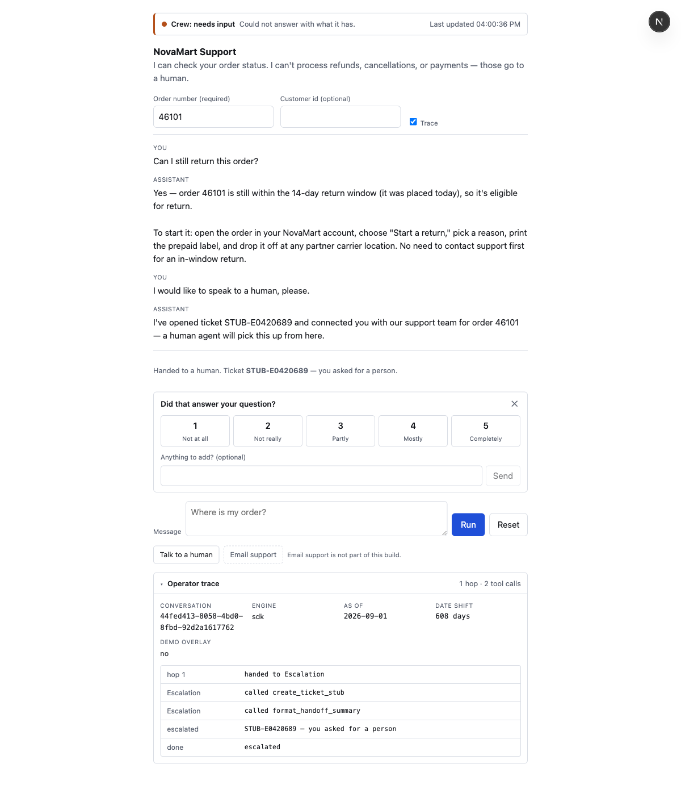
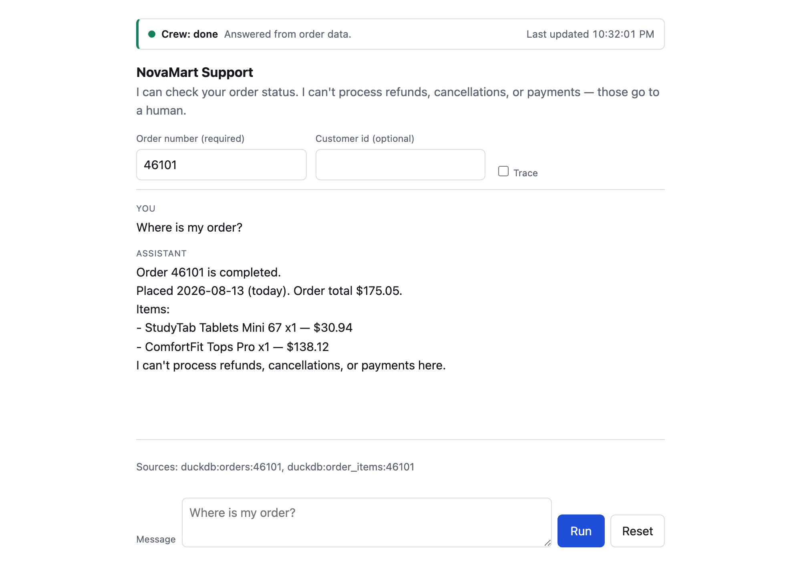

# Multi-Agent Customer Support Crew (NovaMart)

A customer types an order number and a question. It goes to the chat endpoint as a live
stream, and they get one of three honest outcomes: a grounded order answer with citations, a
clarifying question, or the news that a person now owns it. Built with the
[AAMAD](https://pypi.org/project/aamad/) multi-agent development framework.

- **Status — the product runs end to end locally.** Chat UI, streaming API, six registered
  agents with tools, durable conversations, CSAT, and an operator trace panel. Deliver
  artifacts (runbook, CI, Dockerfile) are written. Nothing is money-capable, by construction.
- **The default path is keyless.** `npm run dev` needs no API key: order answers are composed
  in code from the database read, so the demo and CI are reproducible offline. **That path is
  not the crew, and this README never calls it one.**
- **The crew needs a key.** `CHAT_ENGINE=sdk` runs the real `claude-agent-sdk` crew — see
  [Two engines](#two-engines-the-app-and-the-crew). `/api/health` reports which is live, so no
  walkthrough has to be taken on trust.
- **Authoring IDE**: Claude Code · **Target runtime**: `claude-agent-sdk` (TypeScript / Node 24).

## Run it locally

Needs Node 24 (`.nvmrc`) and npm.

```bash
npm install
AS_OF_DATE=2026-09-01 npm run dev     # http://localhost:3000
```

The app falls back to the committed `data/fixtures/novamart_ci.duckdb` (3.2 MB, the five
MVP-read tables with every row). Nothing else is required to start.

**Pin the clock.** The practice database is frozen in 2024–2025, so dates are shifted to land
the newest order on "today". With `AS_OF_DATE` unset that anchor moves every day: the relative
phrases stay true, but every absolute date on screen shifts, and any written walkthrough —
this table included — quietly rots. Evals must pin it for the same reason.

Type an order number, ask "Where is my order?", and press **Run**. Under the pin above, this
is verbatim what comes back:

| Order id | What you should see |
| ---: | --- |
| `46101` | `Placed 2026-09-01 (today)` — raw date in the database is `2025-01-01` |
| `42776` | `Placed 2026-08-19 (13 days ago)` — inside the 14-day return window |
| `1` | `Placed 2025-09-01 (365 days ago)` — correctly outside the window |
| `99999999` | Not found, `needs input` — no invented tracking number |

Then ask **"I want a refund"** on any of them. You get a ticket id, an `escalated` status, and
a sentence saying a human will pick it up — never a refund. That handoff is structural, so it
fires on **both** engines: no money tool is registered anywhere in the process, which is a
stronger claim than a model being instructed to decline.

Conversations are durable: `data/sessions.sqlite` keeps the transcript and the identity you
gave, so a follow-up like "can I still return it?" knows which order you mean, and
`data/ticket_stubs.sqlite` keeps open tickets across a restart. Both are gitignored and both
are created on first run — no setup step.

The operator surface is off unless you switch it on:

```bash
OPERATOR_KEY=some-secret CHAT_ENGINE=sdk npm run dev
curl -H "X-Operator-Key: some-secret" localhost:3000/api/conversations/<id>/trace
```

It returns the hop path, per-turn cost, the transcript, the CSAT record and any tickets
opened. With `OPERATOR_KEY` unset the endpoint is disabled (503) rather than open.

Other useful commands:

```bash
npm run typecheck                        # strict TypeScript
npm test                                 # 153 unit tests
npm run observability                    # error rate, latency and cost from the trace logs
npm run build && npm start               # production build
NOVAMART_DUCKDB_PATH=/path/to/full.duckdb npm run dev   # use the 151 MB practice DB
```

### Error rate, latency and cost

`npm run observability` reads the JSONL trace logs the runtime already writes and reports the
three numbers, with no added dependency and nothing to stand up:

```bash
npm run observability                      # everything on disk
npm run observability -- --since 2026-09-01  # one window
npm run observability -- --json            # machine-readable
```

It reports error rate with the fault events broken out, turn latency (p50/p95/max) alongside
per-tool `durationMs`, and cost totals split **by agent path** — a one-hop
`order-specialist` turn and an `order-specialist → escalation-handoff` turn are different
products at different prices, and the average across them describes neither.

Two things it will tell you that are worth knowing up front. Effectively all latency is the
model: every DuckDB tool answers in under 25 ms, while the `Agent` delegation hop runs seconds.
And turn cost is dominated by cached prompt handling rather than by the customer's actual
question, so the cache hit ratio in the token line is the number to watch when spend moves.

Because it is a reader rather than an exporter, it works on logs written before it existed —
the baseline is your whole history, not "starting today". It covers the `sdk` engine only; the
deterministic engine writes no trace, makes no model call and costs nothing, so it reports
nothing there rather than reporting a misleading zero.

The operator trace panel is in the page itself: add `?trace=1` to the URL (or tick **Trace**)
and it shows the hop path, the tools each agent called, the citations, and the turn's
`{ asOf, shiftDays, overlayHit }`. With trace off it is empty rather than filtered — the server
withholds those frames, and the UI does not work around that.



See [`frontend-functional-spec.md`](frontend-functional-spec.md) for the workflow contract
and [`docs/novamart-demo-90s.mp4`](docs/novamart-demo-90s.mp4) for a 90-second narrated
walkthrough. Stills of the same path — input, result, not-found — are in
[`docs/screenshots/`](docs/screenshots/).



## The full crew walkthrough

All six agents are registered. This is the demo path — start the server with a pinned clock so
every date below is exact:

```bash
export ANTHROPIC_API_KEY=...        # see .env.example, never committed
export MODEL_ID=claude-sonnet-5
CHAT_ENGINE=sdk AS_OF_DATE=2026-09-01 SDK_STREAM_MODE=live npm run dev
```

Ask these in order. Every id is a real row in the committed fixture except where marked, and
the **Routes to** column is what the operator trace will show with `?trace=1`.

| Ask | Identity | Routes to | What proves it worked |
| --- | --- | --- | --- |
| Where is my order? | order `46101` | `order-specialist` | Placed today, $175.05, and an honest "no tracking detail exists here" |
| What have I ordered recently? | user `9970` | `order-specialist` | Five orders, newest first, dates on today's calendar |
| How long is the Plus free trial? | — | `faq-policy` | 14 days, with a `policy:plus#free-trial` citation |
| What is the capital of France? | — | `faq-policy` → `escalation-handoff` | Refuses, opens a ticket, `reason_code=ungrounded` |
| Is my Plus trial still active? | user `45344` | `plus-specialist` | Active, 5 days left — the one DemoOverlay persona |
| What Plus plan am I on? | user `38` | `plus-specialist` | Paid monthly, active, open-ended — a real membership row |
| Can I still return this order? | order `46101` | `returns-advisor` | Inside the 14-day window, with the policy quoted |
| Can I still return this? | order `1` | `returns-advisor` → `escalation-handoff` | 365 days ago, outside the window, handed to a human |
| I sent this back, how long until it is processed? | order `45662` | `returns-advisor` | 3–5 business days from policy, plus real US holidays |
| Please cancel my Plus membership | user `38` | `escalation-handoff` | `reason_code=restricted_action`, and it never claims to have cancelled |
| I want a refund | order `46101` | `escalation-handoff` | `reason_code=payment_or_refund` |

Two things worth watching for, because they are the claims that matter:

- **The crew never answers from model memory.** The France question is the test. If a turn
  reaches no specialist and opens no ticket, the runtime escalates it as `ungrounded`
  regardless of what the model wrote — that is a control in `server/runtime/groundingGuard.ts`,
  not a line of prompt text.
- **Nothing in the system can move money.** Ask for a refund however you like; there is no
  refund function in the process, and `npm run test:invariants` fails the build if one appears.

To see the crew working rather than take it on trust, add `?trace=1` in the browser or send
`"clientFlags":{"trace":true}`, and read the per-turn record in
`project-context/2.build/logs/<conversationId>.jsonl`.

## Two engines: the app and the crew

`CHAT_ENGINE` selects the turn engine. They are different claims and the difference matters
when reading a demo:

| `CHAT_ENGINE` | What runs | Needs a key |
|---|---|---|
| `deterministic` (default) | Order lookup through the repository port + `DateShiftMapper`, reply composed in code. No model call. | No |
| `sdk` | The `claude-agent-sdk` crew: `triage-router` coordinating `order-specialist` and `escalation-handoff` through the `Agent` tool. | Yes |

The deterministic engine exists so the demo and CI stay keyless and reproducible. **It is not
the product.** The capstone claim is the crew, and the crew is the `sdk` engine. `/api/health`
reports which one is live, so a walkthrough never has to be taken on trust:

```bash
curl -s localhost:3000/api/health
# {"engine":"deterministic","sdkEngineConfigured":true,...}
```

Running the crew:

```bash
export ANTHROPIC_API_KEY=...        # see .env.example, never committed
export MODEL_ID=claude-sonnet-5
CHAT_ENGINE=sdk AS_OF_DATE=2026-09-01 npm run dev
npm run eval:sdk                    # all 9 F-EVAL-01 scripts, 114 assertions
```

`npm run eval:sdk` drives nine fixtures against a running server and asserts on both the SSE
wire and the JSONL trace — one script per registered path: WISMO, refund, return status,
grounded policy, ungrounded question, membership, return eligibility, restricted action. Two
assertions carry more weight than the rest. Slice G checks `hops === 1` on a return question,
which is the SAD chain exception holding: `returns-advisor` reads the order **and** the policy
itself rather than costing a second handoff. And every script re-checks that **no money tool
was invoked at runtime** — a different claim from `test:invariants`, which proves none is
*registered*. A captured run is in [`docs/sample-sdk-turn.md`](docs/sample-sdk-turn.md).

Both engines share one seam (`server/runtime/engine.ts`) and one wire contract. Nothing in
`packages/shared/src/dto.ts` changes between them; if it ever has to, the contract-freeze gate
in the SAD has been breached and it belongs in `integration.md`.

## Deploying it

`Dockerfile` + `docker-compose.yml` run the whole thing in one container:

```bash
docker compose up --build          # keyless demo
CHAT_ENGINE=sdk docker compose up --build   # the crew, needs .env.local
```

The compose file publishes to `127.0.0.1:3000` **on purpose** — this build has no
authentication, so it is meant to be reachable only from the machine running it. See
[`project-context/2.build/security.md`](project-context/2.build/security.md) before changing
that, and [`project-context/3.deliver/deploy.md`](project-context/3.deliver/deploy.md) for the
runbook: env matrix, promotion, rollback, and the pre-demo checklist.

New to the app? [`project-context/3.deliver/user-guide.md`](project-context/3.deliver/user-guide.md)
is the install guide and user manual.

## Layout

```
project-context/
  1.define/     MRD, PRD, SAD, quality gate     <- complete
  2.build/      backend, frontend, integration, qa, security
  3.deliver/    deploy, user guide
.claude/
  agents/       AAMAD personas (project-mgr, backend-eng, ...)
  rules/        AAMAD core + runtime adapter rules
  commands/     /phase-1-define, /sync-docs
.cursor/
  templates/    AAMAD artifact templates (shipped for every IDE target)
aamad.config.yml   project preferences — personas load this at start
```

| Artifact | Path |
|----------|------|
| Market Research | `project-context/1.define/mrd.md` |
| Product Requirements | `project-context/1.define/prd.md` |
| System Architecture | `project-context/1.define/sad.md` |
| Quality gate | `project-context/1.define/define-quality-gate.md` |

## Architecture at a glance

Next.js App Router app (UI + BFF route handlers, ADR-09) running a `claude-agent-sdk`
multi-agent runtime. A **Triage** coordinator routes each customer message to one
specialist (FAQ / Order / Plus / Returns), which calls **typed tools** over a read-only
NovaMart DuckDB and an in-repo policy corpus. Restricted or failed paths terminate in
**Escalation**, which writes a ticket stub. Responses stream over SSE (ADR-04).

## Runtime retrofit

Define-phase artifacts were originally authored in Cursor targeting `cursor-sdk`. On
2026-08-08 the project moved to Claude Code and the target runtime changed to
`claude-agent-sdk`. No requirement, acceptance criterion, or architectural flow changed —
see the *Runtime retrofit* section of `project-context/1.define/define-quality-gate.md`
for the full before/after.

## Where this is going

The build is up and the Deliver artifacts are written. What is left is polish, not
scaffolding: the container image has never been built on this machine, hosting is deliberately
deferred, and `project-context/2.build/qa.md` carries the remaining future work — citation
precision, per-hop latency in the trace, a pleasantry eval slice, and the load testing that
nothing has measured against the PRD's ≥5-concurrent and p95 < 30 s targets.

A public host stays out of scope until authentication exists: `project-context/2.build/security.md`
accepts SEC-01 and SEC-02 (any caller can read any order by id; a conversation id acts as a
bearer token) **only** for localhost, single-operator use, which is why `docker-compose.yml`
binds to `127.0.0.1`.
