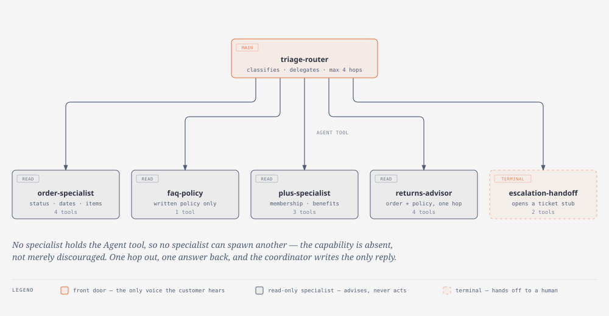
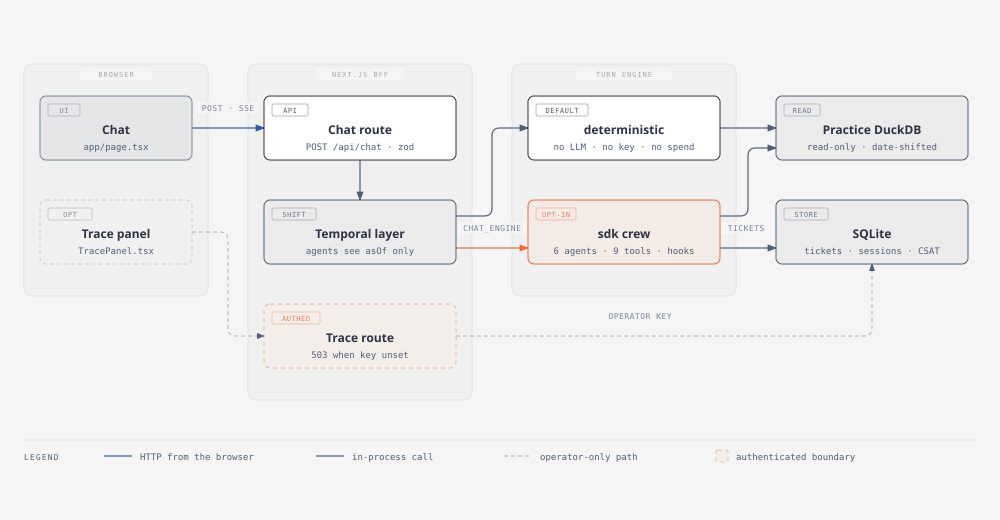

# Agent manual

There are **two completely separate populations of agents** in this repository, and
conflating them is the single biggest source of confusion. They never run at the same
time, they never call each other, and they live in different directories.

| | Build personas | Runtime crew |
|---|---|---|
| **Who they are** | 9 AAMAD personas that *built* this project | 6 NovaMart agents that *answer customers* |
| **Where** | [`.claude/agents/`](../.claude/agents/) | [`server/runtime/agents.ts`](../server/runtime/agents.ts) |
| **When they run** | In your IDE, when you invoke one | At request time, on `POST /api/chat` |
| **What they write** | Markdown in `project-context/` | An SSE reply to a customer |
| **Who reads them** | You | A NovaMart shopper |
| **Cost** | Your Claude Code session | `ANTHROPIC_API_KEY`, and only when `CHAT_ENGINE=sdk` |

Part 1 covers the build personas. Part 2 covers the runtime crew.

---

# Part 1 — Build personas (`.claude/agents/`)

Nine Claude Code subagents, one per AAMAD epic. Each owns exactly one artifact and is
forbidden from writing anyone else's. You invoke one by name, then give it an action
(the `*verb` commands below).

```
Task(subagent_type="qa-eng", prompt="*test-integration")
```

The governing rules are in [`.claude/rules/`](../.claude/rules/) — `aamad-core.md` for the
universal contract, `development-workflow.md` and `delivery-workflow.md` for phase
sequencing, and `adapter-claude-agent-sdk.md` for runtime conventions.

## The roster

### `product-mgr` — @product-mgr
Owns product context and requirements. **Writes:** `1.define/mrd.md`, `prd.md`,
`system-description.md`, `user-stories/`.

| Action | Does |
|---|---|
| `*elicit-requirements` | Structured questionnaire → `system-description.md` |
| `*create-mrd` | Market research document (skippable for internal tools) |
| `*create-prd` | PRD from the system description and/or MRD |
| `*create-context` | MRD + PRD + a handoff summary in one pass |
| `*create-stories` | MVP user stories under `1.define/user-stories/` |

Recommended order: `*elicit-requirements` → `*create-mrd` → `*create-prd` → `*create-stories`,
then hand off to `system-arch`.

### `system-arch` — @system.arch
Owns architecture and per-feature functional specs. **Writes:** `1.define/sad.md`,
`1.define/sfs/<feature-id>.md`.

| Action | Does |
|---|---|
| `*create-sad` | Full SAD — stakeholders, viewpoints, quality attributes, ADRs, four views, traceability |
| `*create-sad --mvp` | Lean SAD: essential views only, everything else explicitly deferred to Future Work |
| `*create-sfs` | Functional spec for one feature or story |

Follows ISO/IEC/IEEE 42010 structure and SEI "Views and Beyond". This project used
`--mvp`; the result is 1,346 lines and is the document every Build artifact traces back to.

### `project-mgr` — @project.mgr
Sets up the skeleton. **Writes:** `2.build/setup.md`. **Explicitly does not write application code** —
if you ask it to, it is instructed to refuse and point you at the right persona.

| Action | Does |
|---|---|
| `*setup-project` | Folder structure and initial files per PRD/SAD |
| `*install-dependencies` | Only what's required; recorded in setup.md |
| `*configure-env` | `.env.example` templates |
| `*document-setup` | Writes it all down |

### `frontend-eng` — @frontend.eng
MVP chat UI and visible stubs for deferred features. **Writes:** `2.build/frontend.md`.
**Does not connect to backend endpoints** — that is `integration-eng`'s job.

`*develop-fe` · `*add-placeholders` · `*style-ui` · `*document-frontend`

### `backend-eng` — @backend.eng
Runtime agents and the chat API. **Writes:** `2.build/backend.md`.

| Action | Does |
|---|---|
| `*develop-be` | Scaffold the backend for the active runtime adapter |
| `*define-agents` | The MVP runtime agent definitions — this is what produced Part 2 below |
| `*implement-endpoint` | The chat API the frontend will call |
| `*stub-nonmvp` | Inert stubs for deferred work → [`server/runtime/stubs.ts`](../server/runtime/stubs.ts) |
| `*document-backend` | Writes it all down |

### `integration-eng` — @integration.eng
Wires the UI to the endpoint. **Writes:** `2.build/integration.md`.

`*integrate-api` · `*verify-messageflow` · `*log-integration`

### `qa-eng` — @qa.eng
Validates the build. **Writes:** `2.build/qa.md`. This artifact is the **gate on Deliver** —
`delivery-workflow.md` forbids starting Phase 3 without it.

| Action | Does |
|---|---|
| `*test-unit` | Unit checks, mapped to AC-* ids |
| `*test-integration` | Cross-layer checks against the fixture DB |
| `*qa` | Smoke, functional, acceptance |
| `*verify-flow` | End-to-end UI ↔ API ↔ runtime |
| `*log-defects` | The defect register |
| `*future-work` | Non-MVP tests for the backlog |

### `security-eng` — @security.eng
Pre-Deliver security assessment. **Writes:** `2.build/security.md`. Required here —
`aamad.config.yml` sets `security.require_security_assessment: true`.

`*assess-security` (severity-ranked findings) · `*scan-secrets` · `*review-deps` · `*document-security`

### `devops-eng` — @devops.eng
Packages the validated MVP. **Writes:** `3.deliver/deploy.md` and `3.deliver/user-guide.md`.

| Action | Does |
|---|---|
| `*prepare-release` | Confirm the QA gate, note security status, summarize scope |
| `*define-deploy` | Dockerfile / compose / platform config |
| `*configure-cicd` | CI for lint, test, build **only** |
| `*document-deploy` | Runbook: hosting, env matrix, access control, rollback |
| `*document-user-guide` | Installation guide and user manual |

**Generates config only.** It will not trigger a live deploy without explicit operator
authorization.

## Rules every persona obeys

- **Read only declared inputs, write only declared outputs.** A persona that needs
  something it wasn't given records an Assumption, not an invention.
- **Every artifact ends with Sources, Assumptions, Open Questions, Audit.** The Audit block
  gets an entry per action, with persona id and timestamp.
- **PRD and SAD are authoritative for scope.** If `aamad.config.yml` disagrees with them,
  the conflict goes under Open Questions and the PRD/SAD win.
- **Halt over guess.** Missing prerequisites, a failed quality gate, or a heading mismatch
  produces a Diagnostic section and a stop.
- **Only the matching adapter rule is loaded.** `AAMAD_TARGET_RUNTIME=claude-agent-sdk` here.
  `adapter-crewai.md` and `adapter-cursor-sdk.md` are on disk as framework artifacts and are
  **not active** — loading them would put two conflicting runtime contracts in context at once.

---

# Part 2 — NovaMart runtime crew (`server/runtime/`)

The six agents that serve a customer turn. They exist only when `CHAT_ENGINE=sdk`; the
default `deterministic` engine answers without any model at all.

<p align="center">
  <a href="diagrams/runtime-crew.html">
    
  </a>
</p>

> Open [`diagrams/runtime-crew.html`](diagrams/runtime-crew.html) in a browser for the
> full-size version.

## The shape of a turn

1. `triage-router` (the coordinator) receives the customer message, the conversation
   history, and any ids already known.
2. It classifies the intent and delegates **once** via the `Agent` tool.
3. The specialist calls its tools, and returns a compact factual summary — never customer-facing prose.
4. The coordinator writes the single reply the customer sees.

Budget: **4 hops per turn** (`MAX_HOPS`, default 4). A hop is an *agent transfer*, not a
tool call. When the budget is spent the runtime refuses further delegation and the
coordinator must escalate with reason `repeat_failure`.

## `triage-router` — the coordinator

The only agent that speaks to the customer, which is what makes "one assistant voice"
true by construction rather than by convention.

**Tools:** `Agent` only. It has no data tools at all.

**It does not answer questions.** Not even ones it knows. Asked the capital of France it
routes to `faq-policy`, which reports the question isn't covered by NovaMart policy — the
honest reply. The reasoning in [`agents.ts`](../server/runtime/agents.ts): a confident
answer from model memory is indistinguishable, to the customer, from a confident answer it
invented about their refund.

The three replies it may write itself: one clarifying question, a relay of a specialist's
findings, or a handoff message.

### Routing table

| Intent | Goes to |
|---|---|
| `order_status` with an order id | `order-specialist` |
| Anything about a **return**, at any stage | `returns-advisor` |
| `plus_membership` with a user id | `plus-specialist` |
| `app_issue` — crash, broken screen, login failure | `faq-policy` |
| `shipping_policy`, `account_question`, `other` | `faq-policy` |
| `payment_question`, `human_request`, refund / cancel / charge / billing | `escalation-handoff` |

Two distinctions that decide the turn:

- **Order vs return.** "Where is my order" is `order-specialist`. "Where does my return
  stand" is `returns-advisor`. Escalating either costs the customer a human wait for a
  question the system can answer.
- **Policy in general vs policy about you.** "How long is the free trial" is `faq-policy`.
  "Is my trial still running" needs `plus-specialist` and a user id.

### Escalation reason codes

| Code | When |
|---|---|
| `payment_or_refund` | Anything that moves money |
| `restricted_action` | A change the system can't make that isn't money — cancel a membership, change an address |
| `customer_requested_human` | They asked for a person. Do not talk them out of it |
| `ungrounded` | A specialist reported the question isn't covered. The honest exit, not a failure |
| `low_confidence` | A specialist answered but it may not address what was asked |
| `high_severity` | Harm, safety, legal threat, distress |
| `repeat_failure` | The hop budget is spent |

## The specialists

Every specialist is **read-only, advisory, and cannot delegate**. None receives the `Agent`
tool, and `disallowedTools` names it (and its `Task` alias) explicitly. A specialist cannot
spawn another specialist even if a prompt injection tells it to, because the capability is
absent — not because the prompt asks it nicely.

None of them address the customer. They return factual summaries with citations to the
coordinator.

### `order-specialist`
Order and line-item facts: status, dates, totals, items.

**Tools:** `get_order`, `get_order_items`, `list_orders_for_user`, `get_processing_calendar`

Notable behaviours:
- No order id but a user id → `list_orders_for_user`, describe the recent orders.
- `get_order_items` **only** when the customer asks what's in the order.
- Status `returned` and the customer is asking about that return → **always** call
  `get_processing_calendar`. It names upcoming public holidays in the customer's country,
  which is honest context for slow processing. It is never a promised date.
- **There is no tracking or carrier tool in this build.** A missing tracking number is a
  permanent property of the system, not a gap a human can close. The order's status and
  dates *are* the answer to "where is my order".

### `faq-policy`
The written policy corpus: shipping, returns rules, Plus benefits and billing, app
troubleshooting. Holds no customer data and can look nothing up about a specific person.

**Tools:** `search_policy`

The tool decides whether the system can answer, and the agent does not overrule it:
- `grounded: true` → answer **only** from the returned chunks, carrying citations.
- `grounded: false` → no policy text scored above the threshold. Do not answer, do not
  reason from general retail knowledge. Report that the question isn't covered. The
  coordinator turns that into an escalation with reason `ungrounded`.

### `plus-specialist`
NovaMart Plus membership for a known user id: plan type, trial or paid, dates, benefits.

**Tools:** `get_membership`, `get_user`, `search_policy`

- `active_as_of_today` and `days_remaining` are computed by the tool against the same clock
  the rest of the system uses. Use them; never recompute the arithmetic.
- The recorded `status` can lag the dates. When they disagree, the dates are what's true
  today, and saying so plainly beats silently picking one.
- `has_membership: false` means the customer never had Plus. That's a complete answer, not
  a failed lookup.
- `search_policy` is in its allowlist because benefit explanations must carry a citation and
  the membership row carries none.

### `returns-advisor`
Whether an order can still be returned and what happens next.

**Tools:** `get_order`, `get_order_items`, `get_processing_calendar`, `search_policy`

This is the deliberate **chain exception**: it holds both the order tools and the policy
tool so it can answer the whole question in one hop. Splitting a return question across
`order-specialist` and `faq-policy` would cost an extra hop and produce a worse answer —
neither of those two can see the other's half.

Eligibility is arithmetic and it must show its work: order date vs today, 14-day window,
state the date and the day count so the customer can check the reasoning. Never round in
the customer's favour to be helpful.

It advises; it does not act. It cannot start, approve, or complete a return, and it cannot
issue, calculate, or promise a refund.

### `escalation-handoff`
Terminal. Hands off to a human.

**Tools:** `create_ticket_stub`, `format_handoff_summary`

It must build a **complete** package — intent, entities, urgency, transcript summary,
reason code, suggested category — and `create_ticket_stub` **rejects a partial package**
rather than writing a degraded one. That rejection is the mechanism behind the PRD's "100%
complete escalations".

It never asks the coordinator for a conversation id, the tools tried, or citations: the
runtime supplies all three from what it watched happen. A question back is not a handoff,
and the customer would be left with nothing.

Reachable even when the hop budget is exhausted.

## Tools — the full surface

Nine tools, all read-only except the ticket stub write. They reach the model as
`mcp__novamart__<name>` from an in-process MCP server.

| Tool | Returns |
|---|---|
| `get_order` | Status, order date, total. `not_found` if the id doesn't exist |
| `get_order_items` | Line items on one order |
| `list_orders_for_user` | Recent orders, newest first, for a user with no order id to hand |
| `get_user` | Signup date, country, primary device. **No payment or address data — the system holds neither** |
| `get_membership` | Plan type, status, dates, `active_as_of_today`, `days_remaining` |
| `get_processing_calendar` | Upcoming public holidays in the customer's country. Not a timeline, not a refund date |
| `search_policy` | Policy chunks with citation ids, or `grounded: false` and no text |
| `create_ticket_stub` | Ticket id. Rejects an incomplete package |
| `format_handoff_summary` | The customer-safe sentence for a ticket id |

### Allowlist matrix

| | order-spec | faq-policy | plus-spec | returns-adv | escalation |
|---|:---:|:---:|:---:|:---:|:---:|
| `get_order` | ● | | | ● | |
| `get_order_items` | ● | | | ● | |
| `list_orders_for_user` | ● | | | | |
| `get_user` | | | ● | | |
| `get_membership` | | | ● | | |
| `get_processing_calendar` | ● | | | ● | |
| `search_policy` | | ● | ● | ● | |
| `create_ticket_stub` | | | | | ● |
| `format_handoff_summary` | | | | | ● |
| `Agent` (delegate) | | | | | |

`triage-router` holds `Agent` and nothing else. The empty cells are enforced, not
aspirational — see the next section.

## The zero-money-tools invariant

No refund, cancellation, payment, or billing tool exists anywhere in this process. That is
enforced by **four independent layers**, none of which is a prompt instruction
([`toolRegistry.ts`](../server/runtime/toolRegistry.ts)):

| Layer | Mechanism |
|---|---|
| **L1** Nothing bound | No refund / cancel / payment function exists in the process |
| **L2** Startup assertion | `assertNoMoneyTools()` **throws** before any agent can be created — a hard boot failure, not a log line |
| **L3** Exact-set test | The registered set must equal a hard-coded literal, so *adding* a tool fails CI even if its name looks innocent (`npm run test:invariants`) |
| **L4** PreToolUse hook | Denies anything outside the per-agent allowlist at call time |

The money-word matcher is deliberately broad — `refund`, `charge`, `billing`, `cancel`,
`checkout`, `payout`, `subscribe` and 18 more, substring-matched. A false positive is a
build error you fix in seconds; a false negative is an unsafe action against a customer's card.

Every SDK built-in is also forbidden to every agent: `Bash`, `Read`, `Write`, `Edit`,
`WebFetch`, `WebSearch`, `Glob`, `Grep`, and the background-agent family
(`SendMessage`, `ListAgents`, `TaskOutput`, `TaskStop`, `Monitor`). Delegation here is
synchronous, so the background tools have no legitimate use and their presence actively
misled the coordinator in an observed turn.

## Hooks — where the rules are actually enforced

[`hooks.ts`](../server/runtime/hooks.ts) is the enforcement layer. Everything the prompts
ask for politely is also made true mechanically:

| Hook | Job |
|---|---|
| `PreToolUse` | Money-tool denial, per-agent allowlist, hop-budget refusal on `Agent` |
| `SubagentStart` | Hop accounting. `hops` increments here and nowhere else |
| `PostToolUse` | Trace frames, and the tool outcomes that populate `tools_tried` on the escalation package |
| `SubagentStop` | Hop close-out. Subagent text is logged for operators, never streamed to the customer |

## Temporal safety

Agents are told exactly one thing about time: `asOf`. The `shiftDays`,
`alignMaxDateToToday` and `overlayHit` fields are operator-trace only and are deliberately
absent from `AgentTemporalView` — an agent that could read `shiftDays` could subtract it
back off and reason about the real 2024 dates in the practice dataset, which is precisely
what the temporal layer exists to prevent. Dates are already shifted by the repository
adapter before an agent sees them.

## Where a turn actually runs

<p align="center">
  <a href="diagrams/turn-lifecycle.html">
    
  </a>
</p>

> Open [`diagrams/turn-lifecycle.html`](diagrams/turn-lifecycle.html) for the full-size version.

Two engines sit behind one interface (`TurnEngine` in [`engine.ts`](../server/runtime/engine.ts)),
speaking the same frozen `StreamEvent` DTOs, so the wire contract and the UI are untouched
by the choice:

- **`deterministic`** — the default. No LLM, no API key, no network. Reads DuckDB and
  composes a grounded sentence in code. This is what the keyless demo runs on.
- **`sdk`** — the crew above. Opt in with `CHAT_ENGINE=sdk`, which requires
  `ANTHROPIC_API_KEY` and `MODEL_ID`. `MODEL_ID` is **required rather than defaulted** on
  purpose: a silently chosen model makes the resolved runtime unauditable.

Ticket stubs are written by the crew; sessions and CSAT are written by the routes. All
three live in SQLite (`data/*.sqlite`), never in the read-only practice DuckDB.

`GET /api/conversations/:id/trace` is **the only authenticated endpoint in the system**,
because of what it returns: hop paths, tools called, prompts, and ticket stubs. It **fails
closed** — with `OPERATOR_KEY` unset it returns 503 and reads nothing, never "no key
configured, so no check".

## Not built (and deliberately so)

Listed in [`stubs.ts`](../server/runtime/stubs.ts), inert on purpose. Nothing there is
registered, imported, or reachable from a turn; every stub throws rather than returning
plausible fake data, because an agent handed invented policy text will present it as
grounded fact.

- `F-WRITE-01` refund / cancel writes — the reason the invariant exists. Never in this repo
  without a new PRD and a human-approval gate.
- `F-ANALYTICS-01` analytics dashboard · `F-COP-01` L1 copilot UI, omnichannel
- Zendesk / carrier / payment integrations
- External MCP servers (ADR-07: MVP tools are in-process)
- Session resume / fork across turns

---

## Quick reference

```bash
npm run dev                # keyless deterministic demo, no spend
npm run test               # full unit + integration suite
npm run test:invariants    # the zero-money-tools exact-set test alone
npm run typecheck          # tsc --noEmit
npm run eval:sdk           # crew eval (needs a key)
```

Everything the runtime reads from the environment is named — values never committed — in
[`.env.example`](../.env.example).

---

**See also:** [`PROJECT-CONTEXT.md`](PROJECT-CONTEXT.md) for the artifacts these personas
produced, and [`../README.md`](../README.md) for the product itself.
