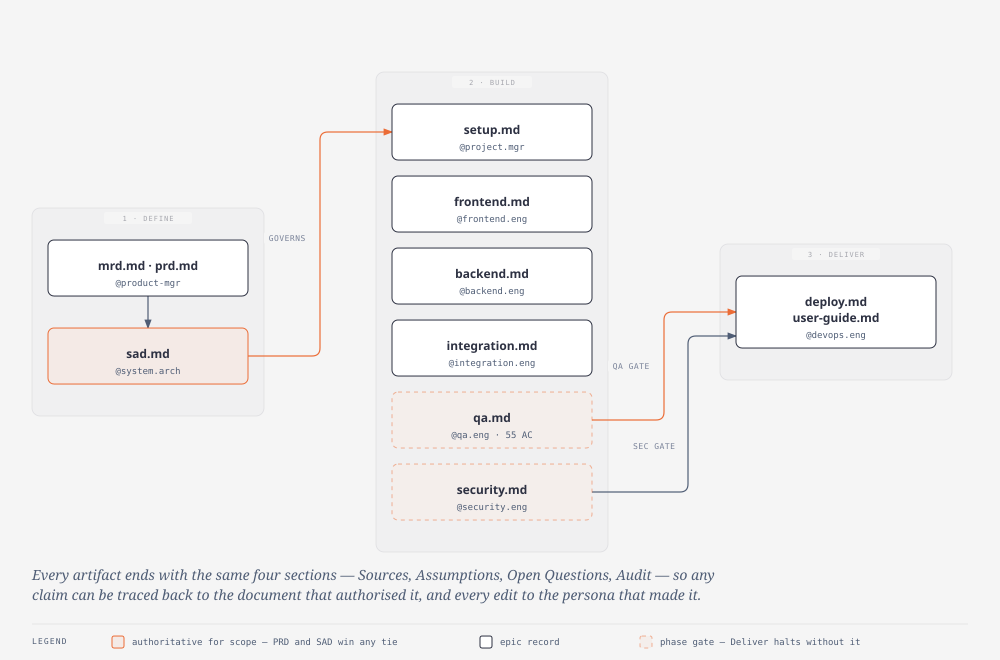

# The `project-context/` guide

`project-context/` is the paper trail. Every architectural decision, every defect, every
accepted risk and every deferral in this project is written down in exactly one file, owned
by exactly one persona, in one of three phase folders.

It is not documentation *about* the code. It is the record the code was built *from*, and
several of its files are hard gates — `qa.md` missing means Phase 3 does not start.

<p align="center">
  <a href="diagrams/aamad-artifacts.html">
    
  </a>
</p>

> Open [`diagrams/aamad-artifacts.html`](diagrams/aamad-artifacts.html) for the full-size version.
> The single arrow from `sad.md` lands on the first Build artifact for legibility — in
> practice the SAD governs **all six**.

---

## The map

```
project-context/
├── 1.define/                    Phase 1 — what and why
│   ├── mrd.md                     market research            @product-mgr    505 lines
│   ├── prd.md                     product requirements       @product-mgr    785 lines
│   ├── sad.md                     system architecture        @system.arch  1,346 lines
│   └── define-quality-gate.md     phase-1 sign-off            operator         87 lines
│                                  (no user-stories/ or sfs/ — see note below)
│
├── 2.build/                     Phase 2 — how it was built
│   ├── setup.md                   environment + deps         @project.mgr    569 lines
│   ├── frontend.md                UI epic                    @frontend.eng   187 lines
│   ├── backend.md                 runtime + API epic         @backend.eng    763 lines
│   ├── integration.md             wiring FE ↔ BE             @integration.eng 555 lines
│   ├── qa.md                      validation  ◀ GATE         @qa.eng         601 lines
│   ├── security.md                assessment  ◀ GATE         @security.eng   325 lines
│   └── logs/                      runtime trace logs (jsonl, ~60 files)
│
├── 3.deliver/                   Phase 3 — shipping it
│   ├── deploy.md                  release + runbook          @devops.eng     330 lines
│   └── user-guide.md              install + user manual      @devops.eng     275 lines
│
└── visuals/                     derived HTML views — NOT authoritative
```

---

## Phase 1 — Define

### `1.define/mrd.md` — Market Research Document
**@product-mgr · `*create-mrd`**

Why this product should exist. Executive summary, findings by dimension, critical decision
points, a risk matrix, and actionable recommendations.

Read it when you want to know *why* a requirement is shaped the way it is. Skip it if you
only need to know what the system does.

### `1.define/prd.md` — Product Requirements Document
**@product-mgr · `*create-prd`**

**The authority on scope.** Feature ids (`F-ORDER-01`, `F-ESC-01`, `F-TICKET-01` …),
acceptance criteria (`AC-*`, 55 of them), priority bands (P0 / P1 / P2 / OUT), and the
non-functional requirements including `NFR-SAFE-01` — the rule that produced the
zero-money-tools invariant.

This is where the project's governing principle lives: **escalate over invent**. Nearly
every unusual design choice downstream traces back to that line.

### `1.define/sad.md` — System Architecture Document
**@system.arch · `*create-sad --mvp`**

**The authority on structure**, and the most-referenced file in the repository. Written to
ISO/IEC/IEEE 42010 structure: stakeholders and concerns, viewpoints, quality attributes,
architectural decisions (ADR-01 … ADR-13), four views (logical, process, deployment, data),
risks, and a PRD → component traceability table.

Source comments across `server/` cite it directly — "SAD §2 Runtime roles", "SAD §4 API
contracts (normative)", "ADR-11". When you find one of those, this is the file it means.

Key ADRs to know:

| ADR | Decides |
|---|---|
| ADR-01 | TypeScript + Node LTS for both frontend and runtime |
| ADR-02 / ADR-09 | Next.js App Router UI with BFF route handlers |
| ADR-05 / ADR-06 | DuckDB is the read-only practice DB; never a write target |
| ADR-07 | MVP tools are in-process, not external MCP servers |
| ADR-10 | Durable stores are SQLite |
| ADR-11 | `search_policy` with a 0.55 grounding threshold |
| ADR-12 | Unit tests use mocked ports; integration uses the repo fixture DuckDB |
| ADR-13 | App issues get `suggested_category: other` |

### `1.define/define-quality-gate.md`
**operator**

The Phase 1 sign-off checklist, the capstone commitment, review findings and how they were
addressed. Also records the **runtime retrofit of 2026-08-08**, when the target moved from
`cursor-sdk` to `claude-agent-sdk` — worth reading if you hit a stale `cursor-sdk` reference
anywhere.

### Not present in this project

`@product-mgr` can also write `1.define/user-stories/` and `@system.arch` can write
per-feature specs to `1.define/sfs/<feature-id>.md`. Neither was used here: the MVP scope
was small enough that the PRD's acceptance criteria carried the story-level detail, and the
lean SAD carried the functional detail. If you add either later, they belong in `1.define/`
alongside the files above.

---

## Phase 2 — Build

Each of these is one epic's working record: what was built, what was verified, what broke,
and what was deferred. They are written *after* the code, and they are expected to drift —
`/sync-docs` exists to reconcile them.

### `2.build/setup.md`
**@project.mgr**

Pinned versions and prerequisites, the actual repository layout, the dependency inventory,
**the environment variable contract**, run instructions, and the fixture / date-shift knobs.

Start here if you are trying to get the thing running. Section 4 (env contract) and
section 6 (fixtures and date-shift) are the two people most often need.

### `2.build/frontend.md`
**@frontend.eng**

What the chat UI does, the Sprint 1 and Sprint 2 slices, defects found by actually using it,
and the client-side test gap. Short by design — the UI is deliberately minimal.

### `2.build/backend.md`
**@backend.eng**

The longest Build artifact and the companion to [`AGENTS.md`](AGENTS.md) Part 2. Covers the
agent roster, tool contracts, the zero-money-tools invariant, execution controls, temporal
safety, single-voice enforcement, observability, stubs, endpoints, durable stores, how to
enable the sdk engine, and a **Known gaps** section worth reading before you file a bug.

### `2.build/integration.md`
**@integration.eng**

The integration surface, the client-side contract pass, message-flow verification, findings,
and runtime adapter compliance. This is where the wire contract between UI and API is
pinned down.

### `2.build/qa.md` — **a gate**
**@qa.eng**

`delivery-workflow.md`: *"Do not start Deliver work until `project-context/2.build/qa.md`
exists and documents MVP verification results (pass or explicitly scoped known gaps)."*

Structured as Unit / Integration / Smoke, plus:
- **Coverage against acceptance criteria** — all 55 AC ids, each mapped to a test.
- **Defect register** — every defect found, its status, and what closed it.
- **Future work** — non-MVP tests, explicitly out of scope rather than forgotten.

Historical passes are kept rather than overwritten, so you can see what was true at each
sprint boundary.

### `2.build/security.md` — **a gate**
**@security.eng**

Severity-ranked findings (Critical / High / Medium / Low / Info) with concrete file paths, a
handoff-readiness verdict, and accepted risks recorded under Assumptions with an owner and a
rationale.

Required here, not optional: `aamad.config.yml` sets `security.require_security_assessment: true`.
If it were missing, `deploy.md` would have to record the operator's explicit acceptance of
the gap under Assumptions.

### `2.build/logs/`

Runtime trace logs, one JSONL file per session, written by the SDK hooks. Machine output,
not prose — grep them, don't read them. Secrets are redacted at write time.

---

## Phase 3 — Deliver

### `3.deliver/deploy.md`
**@devops.eng**

Release readiness (the QA and security gate check), the deploy definition (Dockerfile and
compose), the CI configuration, and the **runbook**: hosting, env-var matrix, access control,
promotion steps, and rollback.

Two things it deliberately does *not* do: name any secret value (env var **names** only,
from `.env.example`), and trigger a live deploy. It generates config; promotion is a human
action.

Its Future Work section lists the deferred ops — monitoring, autoscaling, multi-region,
enterprise IAM and SSO — so they read as decisions rather than oversights.

### `3.deliver/user-guide.md`
**@devops.eng**

The user-facing manual: product overview, prerequisites, installation, getting started,
everyday use, troubleshooting, and operator deployment notes. This is the file to hand
someone who wants to *use* the thing rather than build it.

---

## `visuals/` — derived, not authoritative

HTML renderings (`sad-visual.html`, `backend-visual.html`, `integration-visual.html`,
`submission.html`) plus a workspace file. Same rule as [`docs/README.md`](README.md) states
for the slide deck: **if a visual and the source artifact disagree, the artifact wins.**

The diagrams in [`docs/diagrams/`](diagrams/) are also derived. They are checked in as
`.html` (the editorial source) and `.svg` (for embedding in Markdown).

---

## The contract every artifact keeps

Every file above ends with the same four sections. They are not boilerplate — they are what
makes the record auditable.

| Section | Holds |
|---|---|
| **Sources** | The PRD/SAD/SFS anchors and files this artifact drew on. Every claim traces to one |
| **Assumptions** | What was assumed because the input didn't say. Accepted risks live here too, with an owner |
| **Open Questions** | What is still unresolved. An honest gap, recorded rather than papered over |
| **Audit** | One entry per action: persona id, action name, timestamp, resolved runtime. Additive — prior entries are never deleted |

Two rules that follow from this:

- **Never fabricate to fill a section.** A persona with a missing input writes an Assumption
  or an Open Question. It does not invent a requirement.
- **PRD and SAD win any conflict.** If `aamad.config.yml`, a Build artifact, or a visual
  disagrees with them, the conflict is recorded under Open Questions and the Define artifacts
  remain authoritative for scope.

---

## Working with these files

### Keeping them true

```
/sync-docs
```

Reconciles the Build and Deliver artifacts against the code as it currently exists. It
diffs documented claims (endpoints, env vars, agent roles, UI flows, deploy commands)
against the source tree, updates what drifted, preserves the four required sections, and
appends an Audit entry noting what changed.

It treats `prd.md` and `sad.md` as read-only unless architecture genuinely changed — and
then only with operator confirmation. Prefer a fresh context when you run it.

### Checking the gates

```bash
aamad validate --phase deliver
```

### Reading order

| If you want to… | Read |
|---|---|
| Run it locally | `setup.md` §4–5, then `user-guide.md` §3 |
| Understand why it's built this way | `prd.md` (scope) → `sad.md` (structure) |
| Understand the agents | [`docs/AGENTS.md`](AGENTS.md), then `backend.md` |
| Know what's tested | `qa.md` — the AC coverage table |
| Know what's risky | `security.md` findings, then `backend.md` Known gaps |
| Ship it | `deploy.md` runbook |
| Know what was *deliberately* left out | `stubs.ts`, `qa.md` Future work, `deploy.md` Future work |

---

**See also:** [`AGENTS.md`](AGENTS.md) for the personas that wrote these files and the
runtime crew they built, and [`../.claude/rules/`](../.claude/rules/) for the rules that
govern both.
