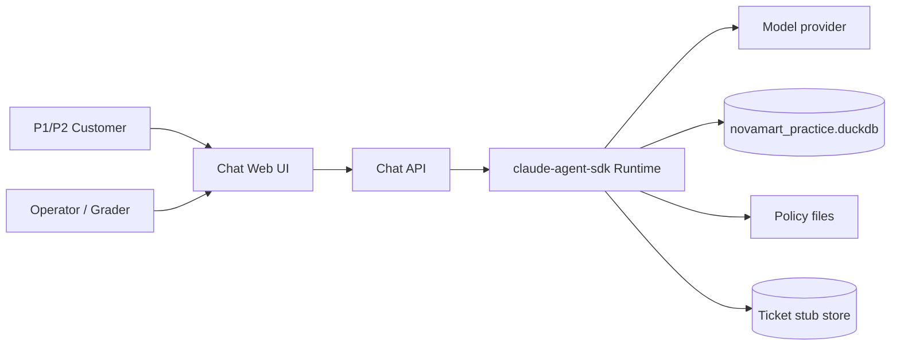
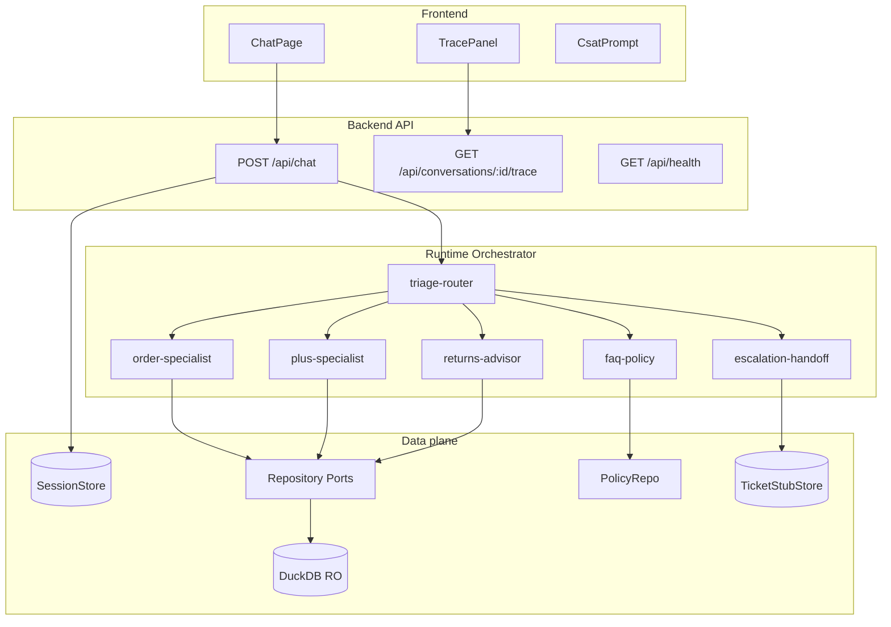
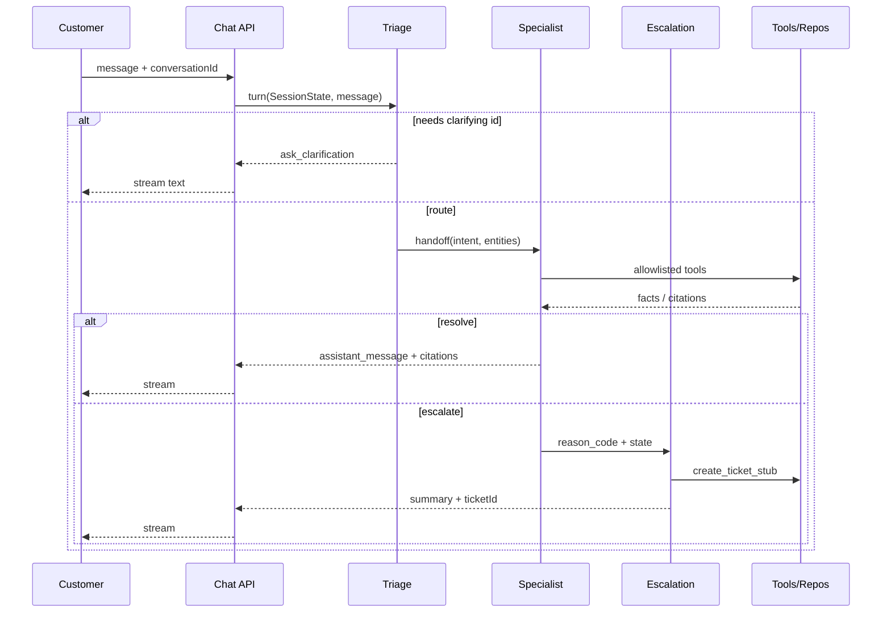
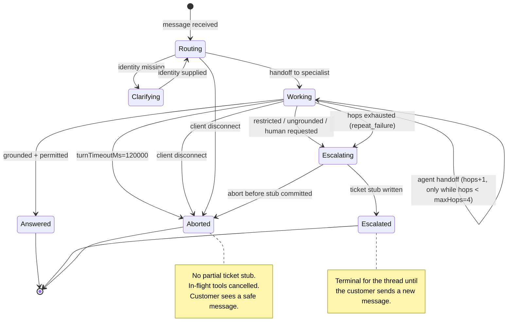
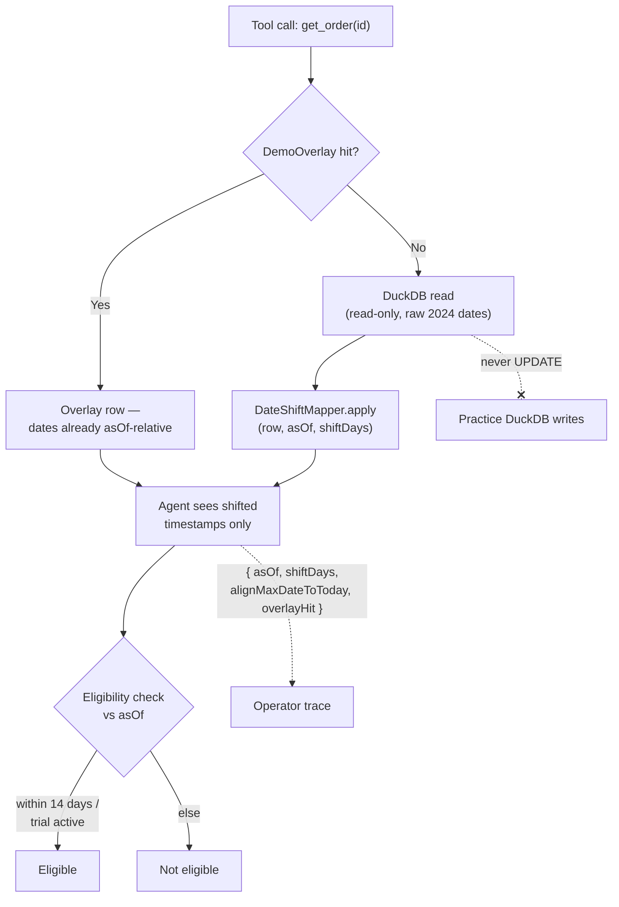
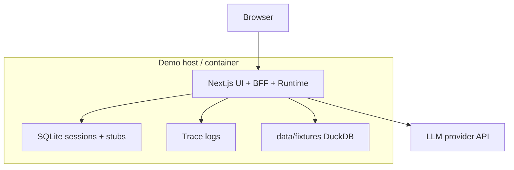

# System Architecture Document (SAD)

## Multi-Agent Customer Support Crew for NovaMart — MVP

## Input Requirements


| Input                | Reference                                                                                             |
| -------------------- | ----------------------------------------------------------------------------------------------------- |
| **PRD**              | `project-context/1.define/prd.md`                                                                     |
| **MRD**              | `project-context/1.define/mrd.md`                                                                     |
| **User Stories**     | Not yet authored (`project-context/1.define/user-stories/` empty) — PRD feature IDs are authoritative |
| **MVP Scope**        | Customer chat + hierarchical multi-agent crew + DuckDB read tools + synthetic policy + ticket stubs   |
| **Selected Runtime** | `claude-agent-sdk` (retrofitted 2026-08-08 from `cursor-sdk`)                                         |
| **Adapter rule**     | `.claude/rules/adapter-claude-agent-sdk.md`                                                           |


**Audience**: Build-phase epics — Solution/Project setup, Frontend, Backend, Integration, QA, Security, DevOps.

**Document status**: `FINAL-FOR-BUILD` (quality pass 2026-08-08). Architecture decisions below are **normative** for Capstone Build — do not reopen without revising PRD/SAD together.

---


### 1. MVP Architecture Philosophy & Principles


#### MVP Design Principles

1. **Customer chat first** — one assistant voice; operator trace is secondary.
2. **Tools over memory** — order/Plus facts come from repositories, not model recall.
3. **Least-privilege agents** — hard tool allowlists per role (PRD §3.2).
4. **Escalate over invent** — ungrounded or restricted → Escalation agent.
5. **Observable by default** — every hop logged with agent id, tools, latency.
6. **Swap-ready data** — repository ports; DuckDB today, other DB later.
7. **Lean deploy** — local/dev + single-host; no multi-region.


#### Core vs Future


| In MVP                                         | Deferred (PRD P2 / OUT)               |
| ---------------------------------------------- | ------------------------------------- |
| 6-agent hierarchical crew                      | Scenario D analytics dashboard        |
| Streaming web chat + operator trace            | L1 copilot UI, omnichannel            |
| DuckDB read + policy files + ticket stub store | Payment/refund writes, Zendesk export |
| Eval scripts + structured logs                 | Horizontal scale, full APM, SSO       |


**Agent-count note**: SAD template suggests 3–4 agents; **PRD locks six** (`triage-router`, `faq-policy`, `order-specialist`, `plus-specialist`, `returns-advisor`, `escalation-handoff`). Architecture keeps six — specialization is a safety and grounding boundary, not optional polish.

#### Technical Architecture Decisions (summary)


| ID     | Decision                                                    | Rationale                                                                                          |
| ------ | ----------------------------------------------------------- | -------------------------------------------------------------------------------------------------- |
| ADR-01 | TypeScript + Node LTS for FE + BE runtime | `claude-agent-sdk` adapter; `aamad.config.yml` → `language.primary: typescript` |
| ADR-02 | Next.js (App Router) + React for chat UI                    | Fast streaming chat MVP; minimal UI (`visual_style: minimal`)                                      |
| ADR-03 | Hierarchical coordinator (Triage) + specialists             | PRD orchestration; maps to `claude-agent-sdk` main-agent coordinator + `AgentDefinition` specialists |
| ADR-04 | **SSE** (`text/event-stream`) for tokens + trace events | PRD streaming + F-TRACE-01; single envelope |
| ADR-05 | Repository ports + DuckDB read adapter + DateShiftMapper + DemoOverlay | MRD/PRD DB-swap; F-TIME-01 |
| ADR-06 | Writable ticket stubs outside practice DuckDB | Practice DB is read-only |
| ADR-07 | No MCP servers required for MVP | Tools are in-process |
| ADR-08 | Max ≤4 specialist hops / turn then force escalate | PRD F-ORCH-01 |
| ADR-09 | **Next.js App Router BFF** — API route handlers in same app as UI | Simplest Capstone deploy; one Node process |
| ADR-10 | **SQLite** for SessionStore + TicketStubStore (file under `data/`) | Survives refresh for demo; still single-host |
| ADR-11 | Policy search = **section/keyword score**; threshold **0.55** | PRD AC-FAQ-01/05; no vector DB |
| ADR-12 | CI DuckDB = **repo fixture copy** + port mocks in unit tests | PRD OQ-3 resolved |
| ADR-13 | `app_issue` → `suggested_category = other` | PRD AC-ESC-05 |
| ADR-14 | **Temporal layer**: date-shift + `AS_OF_DATE` + demo overlay | Practice DB is 2024; keep 14-day/Plus demos real (PRD F-TIME-01) |
| ADR-15 | **One external integration**: Nager.Date public-holiday calendar, keyless, read-only, degrade-never-throw | `orders` has no tracking number and no in-transit rows, so a carrier integration would have meant inventing shipments; `users.country` is real, so return-processing context is grounded (amended 2026-08-27) |
| ADR-16 | **`escalate` is part of the `TurnEngine` contract, not the sdk engine's alone** | `deterministic` is the DEFAULT engine; a money-adjacent request must reach a human on every engine (PRD F-ESC-01), amended 2026-08-27 |
| ADR-17 | **Terminal-state guarantees are enforced by the runtime, not by coordinator prompt text** | Both ADR-08's forced escalation and "escalate over invent" were prompt requests the model could and did decline; a guarantee the model may opt out of is not a guarantee (added 2026-08-28) |
| ADR-18 | **Cross-engine parity is scoped to terminal STATUS, not to specialist coverage** | ADR-16 obliges both engines to route a money ask to a human; it does not oblige `deterministic` to reimplement policy search or membership reads, which would mean writing a second, keyless crew to prove the first one (added 2026-08-28) |
| ADR-19 | **`turnTimeoutMs=120000`, not 60000** | The 60 s budget was set before any turn had been measured. Delegation is forced synchronous (ADR-17's `canUseTool` rewrite of `run_in_background`), so a specialist hop is wall-clock serial: measured p95 is 28.6 s for one hop and **44–54 s for two**, with a 63.1 s maximum over 359 turns. A 60 s cap therefore aborts real turns *after* the work is done and the tokens are paid for — the customer waits a minute and receives an error for an answer the system had already produced. 120 s keeps the runaway guard the budget exists for while clearing the measured two-hop distribution (added 2026-09-04) |


---


### 1A. Architecture Overview


#### High-level description

The system is a **web chat application** backed by a **Node/TypeScript API** that runs a **`claude-agent-sdk` multi-agent runtime**. Each customer message is processed by a **Triage** coordinator that routes to one specialist (optionally chaining Returns after Order). Specialists call **typed tools** backed by **NovaMart DuckDB** (read) and a **policy corpus** (search). Restricted or failed paths end in **Escalation**, which writes a **ticket stub** and returns a customer-safe summary.

#### Main functions


| Function                  | Owner component                      | PRD features           |
| ------------------------- | ------------------------------------ | ---------------------- |
| Conversational UX         | Chat Web App                         | F-CHAT-01, F-CSAT-01   |
| Agent orchestration       | Runtime Orchestrator                 | F-ORCH-01, F-TRIAGE-01 |
| Grounded Q&A              | faq-policy + PolicyRepo              | F-FAQ-01               |
| Order / Plus facts        | order/plus agents + DuckDB + temporal layer | F-ORDER-01, F-PLUS-01, F-TIME-01 |
| Demo-current personas     | DemoOverlay (3–5 rows)               | F-TIME-01, F-EVAL-01   |
| Returns advice            | returns-advisor                      | F-RET-01               |
| Human handoff (simulated) | escalation + TicketStubStore         | F-ESC-01, F-TICKET-01  |
| Operator visibility       | Trace side panel + Prompt Trace logs | F-TRACE-01             |
| Quality gates             | Eval harness                         | F-EVAL-01              |


#### Main interfaces

```text
[Browser Chat UI]
       |  HTTPS
       |  POST /api/chat (SSE stream)
       |  GET  /api/health
       |  GET  /api/conversations/:id/trace  (operator)
       v
[Next.js Route Handlers (BFF) — ADR-09]
       |
       +--> [Runtime Orchestrator (claude-agent-sdk)]
       |         +--> Agents (6)
       |         +--> Tools --> Repository Ports
       |
       +--> [Session Store] (SQLite — ADR-10)
       +--> [Ticket Stub Store] (SQLite — ADR-10)
       +--> [Policy Corpus] (files)
       +--> [NovaMart DuckDB] (read-only)
```


#### Context diagram




---


### 2. Multi-Agent System Specification (Logical Architecture)


#### Logical component catalog


| Component                               | Responsibility                                                | Epic owner            |
| --------------------------------------- | ------------------------------------------------------------- | --------------------- |
| **Chat Web UI**                         | Messages, identity fields, CSAT, human button, optional trace | Frontend              |
| **Chat API**                            | Validate requests, open stream, map errors                    | Backend / Integration |
| **Session Manager**                     | `conversationId`, transcript, `SessionState`                  | Backend               |
| **Runtime Orchestrator**                | Turn loop, hop budget, allowlists, cancellation               | Backend               |
| **Agents (×6)**                         | Domain behavior per PRD §3.2                                  | Backend               |
| **Tool Layer**                          | JSON-serializable tool contracts                              | Backend               |
| **Order/User/Membership/Product Repos** | Read ports                                                    | Backend               |
| **DuckDB Adapter**                      | SQL impl of read ports                                        | Backend               |
| **Policy Repository**                   | Chunk + search                                                | Backend               |
| **Ticket Stub Store**                   | Persist escalation packages                                   | Backend               |
| **Trace / Prompt Logger**               | Hop + tool diagnostics                                        | Backend               |
| **Eval Runner**                         | Scripted dialogues                                            | QA                    |


#### Logical architecture diagram




#### Agent collaboration pattern

**Pattern**: Hierarchical router (not fully autonomous swarm).




#### SessionState (normative shape)

```typescript
type SessionState = {
  conversationId: string;
  transcript: Array<{ role: "user" | "assistant" | "system"; content: string; ts: string }>;
  identity: { userId?: number; orderId?: number };
  intent?: string;
  entities: {
    order_id?: number;
    user_id?: number;
    device?: string;
    app_version?: string;
  };
  urgency?: "low" | "medium" | "high" | "critical";
  toolResults: Array<{ tool: string; argsHash: string; ok: boolean; summary: string }>;
  citations: string[];
  hops: number;
  lastAgents: string[];
  pendingEscalation?: boolean;
};
```


#### Tool contracts (MVP)


| Tool                     | Agents             | In                     | Out                         | Side effect      |
| ------------------------ | ------------------ | ---------------------- | --------------------------- | ---------------- |
| `get_user`               | triage, plus       | `{ user_id }`          | user row summary            | none             |
| `get_order`              | order, returns     | `{ order_id }`         | order summary               | none             |
| `get_order_items`        | order, returns     | `{ order_id }`         | line items[]                | none             |
| `list_orders_for_user`   | order              | `{ user_id, limit≤5 }` | orders[]                    | none             |
| `get_membership`         | plus               | `{ user_id }`          | membership summary          | none             |
| `search_policy`          | faq, plus, returns | `{ query, top_k }`     | `{ chunks[], citations[] }` | none             |
| `create_ticket_stub`     | escalation         | `EscalationPackage`    | `{ ticket_stub_id }`        | write stub store |
| `format_handoff_summary` | escalation         | package                | markdown/text               | none             |


**Forbidden in MVP**: any payment, refund, cancel-order, membership-mutate, shell, arbitrary network tools.

#### claude-agent-sdk runtime-conditional configuration


| Control             | MVP default                                                                                      | Notes                                                                      |
| ------------------- | ------------------------------------------------------------------------------------------------ | -------------------------------------------------------------------------- |
| Runtime roles       | Main agent = `triage-router` coordinator; specialists as `AgentDefinition` entries in `ClaudeAgentOptions.agents`, invoked via the `Agent` tool | Adapter Mapping: coordinator + specialists |
| Language            | TypeScript / Node LTS                                                                            | Pin in setup epic                                                          |
| Streaming envelope  | See §4                                                                                           | Contract-first before FE/BE impl                                           |
| Turn / hop budget   | `maxHops=4`                                                                                      | Then `reason_code=repeat_failure`                                          |
| Time budget         | `turnTimeoutMs=120000` (ADR-19)                                                                  | Cancel in-flight tools; safe user message. 120 s, not 60 s: a two-hop turn measures 44–54 s p95 and 60 s aborted completed work |
| Token / cost budget | Configurable `maxOutputTokens` per turn                                                          | Halt + Diagnostic on overrun                                               |
| Effort              | `MODEL_EFFORT` default `low` (low / medium / high / xhigh / max)                                  | Determinism lever for evals. **Temperature is unavailable**: it was removed from the Anthropic Messages API on the target models (Opus 5, Sonnet 5, Opus 4.7/4.8 reject it with HTTP 400) and `@anthropic-ai/claude-agent-sdk` exposes no temperature option, so no value could reach the model. Reproducibility comes from `effort` + pinned `AS_OF_DATE` + the keyless deterministic engine |
| Thinking            | `thinking` + `effort`; fixed `MAX_THINKING_TOKENS` budget applies to **older** models only (e.g. `claude-haiku-4-5`) | SDK `maxThinkingTokens` is deprecated and model-dependent — on Opus 4.6 any non-zero value behaves as an on/off switch rather than a cap |
| MCP                 | **None required**                                                                                | Future Work                                                                |
| Sessions / resume   | Conversation id in SQLite SessionStore                                                           | No cross-user memory; file-backed for demo refresh (ADR-10) |
| Retries             | Tool read: **1** retry on transient failure; no retry on validation errors                       | Idempotent reads                                                           |
| Cancellation        | Client disconnect or timeout → abort orchestrator; no partial ticket unless Escalation completed | Document in runbook                                                        |
| Prompt Trace        | Persist under `project-context/2.build/logs/` (redacted)                                         | Adapter Quality Gates                                                      |
| Tool permissions    | Per-agent `allowed_tools` allow-list; no built-in `Bash`/`WebFetch`/`WebSearch`/`Write` in MVP   | Adapter Tools: least privilege; enforces the Forbidden-in-MVP list above   |
| Lifecycle hooks     | `PreToolUse` / `PostToolUse` / `SubagentStart` / `SubagentStop` → Trace Log + guardrails          | Adapter Logging; feeds F-TRACE-01 operator panel                           |
| Client mode         | `ClaudeSDKClient` for the streaming chat turn (bidirectional + SSE bridge)                        | Adapter Execution                                                          |

##### Turn lifecycle (budgets, cancellation, terminal states)

The budgets above are only meaningful as transitions. Every exit is one of three terminal
states — answered, escalated, or aborted — and `Aborted` is the only one that writes no
ticket stub.



#### Intent → agent map (from PRD)


| Intent             | Primary agent                          | Terminal?           |
| ------------------ | -------------------------------------- | ------------------- |
| `order_status`     | order-specialist                       | resolve or escalate |
| `plus_membership`  | plus-specialist                        | resolve or escalate |
| `returns_policy`   | returns-advisor                        | resolve or escalate |
| `shipping_policy`  | faq-policy                             | resolve or escalate |
| `app_issue`        | faq-policy → escalate if no workaround | often escalate      |
| `payment_question` | escalation-handoff                     | terminal            |
| `account_question` | faq-policy or escalate if mutation     | —                   |
| `human_request`    | escalation-handoff                     | terminal            |
| `other`            | faq-policy → escalate if ungrounded    | —                   |


#### Hop accounting (normative)

**A hop is an agent transfer, not a tool call.** `SessionState.hops` increments on — and only
on — a `triage-router → specialist` handoff or a `specialist → escalation-handoff` handoff.
Tool calls made by an agent *within* its own turn never increment `hops`, regardless of how
many tools it calls or how many repositories those tools touch.

Consequences `@backend-eng` must implement exactly:

| Event | `hops` |
| ------- | ------ |
| `triage-router` asks a clarifying question (no handoff) | unchanged |
| `triage-router → order-specialist` | **+1** |
| `order-specialist` calls `get_order`, then `get_order_items` | unchanged |
| `returns-advisor` calls `search_policy` **and** `get_order` + `get_order_items` | unchanged |
| `order-specialist → escalation-handoff` | **+1** |
| Re-route by triage to a second specialist | **+1** |

The budget is checked *before* a handoff: if `hops` is already `maxHops=4`, the orchestrator
does not perform the handoff and instead forces `escalation-handoff` with
`reason_code=repeat_failure`. The forced escalation handoff itself is exempt from the check
(it is the terminal state, not a further hop) — otherwise a hop-exhausted turn would have no
legal exit.

**Chain exception (restated under this rule)**: `returns_policy` routes to `returns-advisor`
as a single hop; that agent may then call order tools itself without further hop cost. If the
order id is missing, triage asks a clarifying question first — which costs no hop.

---


### 3. Frontend Architecture Specification


#### Stack


| Layer            | Choice                                            | Rationale                                     |
| ---------------- | ------------------------------------------------- | --------------------------------------------- |
| Framework        | **Next.js** (App Router) **BFF**                  | UI + `app/api/*` in one app (ADR-09)          |
| UI               | React + minimal CSS (CSS modules or Tailwind)     | `visual_style: minimal`; no card-heavy chrome |
| Types            | TypeScript strict                                 | Config `type_checking: true`                  |
| State            | React state + conversation id in URL/localStorage | No Redux required                             |
| Streaming client | `fetch` + `ReadableStream` / EventSource          | Match API envelope                            |


#### Application structure (suggested)

apps/web/   (or repo-root Next app)
  app/
    page.tsx
    api/chat/route.ts
    api/health/route.ts
    api/conversations/[id]/trace/route.ts
  components/  (ChatWindow, MessageList, Composer, IdentityBar, CsatPrompt, TracePanel, HumanHandoffButton)
  lib/chatClient.ts
  server/      (orchestrator, agents, tools, data — Node-only)
packages/shared/src/dto.ts
data/fixtures/novamart_practice.duckdb   # local authoritative dataset (151 MB, gitignored)
data/fixtures/novamart_ci.duckdb         # committed CI / fresh-clone fixture (3 MB, code default)
data/demo_overlay.json        # F-TIME-01 personas
data/policy/*.md
data/sessions.sqlite          # runtime
data/ticket_stubs.sqlite      # runtime


#### UI requirements


| Requirement         | Spec                                                        |
| ------------------- | ----------------------------------------------------------- |
| Primary surface     | Single chat column; welcome explains no refunds             |
| Identity            | Inputs for `orderId` / `userId` before or during first turn |
| Streaming           | Show incremental assistant text                             |
| Loading             | Disable send while turn in flight; show subtle progress     |
| Errors              | Plain language + “Talk to a human”                          |
| Trace               | Hidden by default; `?trace=1` or toggle                     |
| A11y                | Keyboard send, labels, contrast best-effort AA              |
| Future placeholders | None required beyond disabled “Email support” optional stub |


**Frontend epic boundary**: Build UI + client against **mocked stream** first; Integration wires real API.

---


### 4. Backend Architecture Specification


#### Suggested package layout

```text
apps/web/server/             # imported only from route handlers (ADR-09)
  runtime/orchestrator.ts
  runtime/agents/*.ts
  runtime/tools/*.ts
  runtime/budgets.ts
  data/ports.ts
  data/duckdb/*.ts
  data/policy/*.ts
  data/stubs/*.ts
  data/session/*.ts
  logging/trace.ts
packages/shared/src/dto.ts
```


#### API contracts (normative)


##### `POST /api/chat`

**Request**

```typescript
type ChatRequest = {
  conversationId?: string;       // create if absent
  message: string;
  identity?: { userId?: number; orderId?: number };
  clientFlags?: { trace?: boolean };
};
```

**Response**: `Content-Type: text/event-stream` (SSE)

```typescript
type StreamEvent =
  | { type: "session"; conversationId: string }
  | { type: "token"; text: string }
  | { type: "agent_hop"; agentId: string; hop: number }      // omit if !trace
  | { type: "tool_call"; agentId: string; tool: string }     // omit/redact if !trace
  | { type: "citation"; ids: string[] }
  | { type: "escalation"; ticketStubId: string; reasonCode: string }
  | { type: "csat_prompt" }
  | { type: "error"; code: string; message: string; retryable: boolean }
  | { type: "done"; status: "resolved" | "escalated" | "needs_input" };
```


##### `EscalationPackage` (normative shape — PRD §3.2 `escalation-handoff`)

Input to `create_ticket_stub`; one row in the TicketStubStore. Every field marked required
must be non-empty at write time — `create_ticket_stub` **rejects** a partial package rather
than writing a degraded stub. This is the binary check behind PRD "100% complete escalations"
(F-ESC-01 / F-TICKET-01) and `AC-EVAL-04`.

```typescript
type ReasonCode =
  | "customer_requested_human"
  | "ungrounded"
  | "restricted_action"
  | "low_confidence"
  | "repeat_failure"
  | "high_severity"
  | "payment_or_refund";

type EscalationPackage = {
  // --- required ---
  conversationId: string;
  intent: string;                                  // from SessionState.intent; "other" if unresolved
  entities: {                                      // what triage/specialists actually extracted
    order_id?: number;
    user_id?: number;
    device?: string;
    app_version?: string;
  };
  urgency: "low" | "medium" | "high" | "critical";
  transcript_summary: string;                      // customer-safe; no raw tool JSON, no PII beyond ids
  tools_tried: Array<{ tool: string; ok: boolean; summary: string }>;  // may be [] — must be present
  citations: string[];                             // may be [] — must be present
  reason_code: ReasonCode;
  suggested_category: string;                      // `other` for app_issue (ADR-13)
  // --- populated on write ---
  ticket_stub_id: string;                          // returned by create_ticket_stub
  created_at: string;                              // ISO; stamped with asOf-aware clock
};
```

**Validator rule (QA-checkable)**: a package is *complete* iff `conversationId`, `intent`,
`urgency`, `transcript_summary`, `reason_code`, and `suggested_category` are non-empty
strings, `entities` / `tools_tried` / `citations` are present (empty allowed), and
`reason_code` is a member of `ReasonCode`. `entities` must additionally contain at least one
identifier (`order_id` or `user_id`) **unless** `reason_code` is `customer_requested_human`
or `ungrounded`, where the customer may never have supplied one.

`transcript_summary` is the only free-text field the customer's words reach; the redaction
rules in §8 apply to it before persistence.

##### `GET /api/conversations/:id/trace`

Returns ordered hops for operator panel (F-TRACE-01). Auth: MVP = local-only / shared demo secret header `X-Operator-Key` from env.

**Built 2026-08-28.** Returns `{ hops, turns, transcript, identity, csat, ticketStubs }`. It
**fails closed**: with `OPERATOR_KEY` unset the endpoint is disabled (503) rather than open —
an endpoint that becomes public when an env var is forgotten is worse than one switched off.
The `:id` segment is sanitised before it reaches the filesystem.

##### `POST /api/conversations/:id/csat`

Records a 1–5 CSAT score with an optional comment (F-CSAT-01). Added 2026-08-28: `csat_prompt`
is emitted immediately before `done` on any turn that reached a terminal state other than
`needs_input`, and this is where the answer is written. Unauthenticated, like `/api/chat`, and
for the same reason — it is a customer surface on a localhost MVP.

##### `GET /api/health`

`{ status: "ok", runtime: "claude-agent-sdk", duckdb: "ok"|"error", version }`

##### Error envelope (non-stream)

```typescript
type ErrorBody = { code: string; message: string; details?: unknown };
```

HTTP: 400 validation, 404 unknown conversation, 429 rate limit (simple in-memory), 500 unexpected.

**429 implemented 2026-08-28**: fixed window, 20 turns/minute/client, `RATE_LIMIT_PER_MIN` to
tune and `0` to disable, checked before body parsing. It is a **cost guard, not access
control** — `/api/chat` is unauthenticated and spends the operator's API key on the sdk
engine, so a loop against it is a bill. Per-process and keyed on a spoofable client address;
`@security.eng` should read it as such.

#### Data architecture


| Store | Tech | Contents | Retention |
| ----- | ---- | -------- | --------- |
| NovaMart practice DB | DuckDB **read-only** | users, orders, order_items, products, memberships | External / fixture |
| **Demo overlay** | `data/demo_overlay.json` | 3–5 personas with dates relative to `asOf` | Repo |
| Policy corpus | Markdown on disk | Shipping, returns, Plus, app troubleshooting | Repo |
| SessionStore | **SQLite** `data/sessions.sqlite` | SessionState + transcript + CSAT | Demo volume |
| TicketStubStore | **SQLite** `data/ticket_stubs.sqlite` | EscalationPackage rows | Demo volume |
| Trace logs | `project-context/2.build/logs/` | Redacted Prompt Trace | Build artifact |

#### Temporal layer (ADR-14 / PRD F-TIME-01)

```text
Tool get_order(id)
  → DemoOverlay.lookup(id) if hit → return overlay row (dates already asOf-relative)
  → else DuckDB read raw row
  → DateShiftMapper.apply(row, asOf, shiftDays)
  → agent sees shifted timestamps only
```



Raw dates never reach the agent: the shift is applied inside the repository adapter, not
in agent prompts. This is what keeps a fixed 2024 dataset demo-usable against a moving
`asOf` without ever writing to the practice DB.

| Knob | Default | Behavior |
|------|---------|----------|
| `ALIGN_MAX_DATE_TO_TODAY` | `true` | `shiftDays = asOf − max(order_date)` |
| `AS_OF_DATE` | unset (= today) | Clock for eligibility + shift anchor |
| `DATE_SHIFT_DAYS` | unset | If set, overrides auto shift |
| `DEMO_OVERLAY_PATH` | `data/demo_overlay.json` | Precedence over DuckDB |

**Rules**: Never UPDATE the practice DuckDB. Eligibility (14-day returns, trial active) uses `asOf` + shifted/overlay dates. Operator trace includes `{ asOf, shiftDays, alignMaxDateToToday, overlayHit }`.

##### Validated against the practice DB (2026-08-08)

Measured directly from `novamart_practice.duckdb` (read-only connection):

| Observation | Value |
|-------------|-------|
| `max(orders.order_date)` | `2025-01-01` |
| Resulting `shiftDays` at `asOf = 2026-08-08` | **584** |
| Orders landing inside a 14-day return window post-shift | **3,335** of 47,199 |
| `max(memberships.ended_at)` | `2025-01-13` — **12 days past** the order anchor |
| Memberships still active at the anchor | **79** of 5,513 (1.4%) |

Three consequences the Build epics must honor:

1. **The 12-day membership overshoot is correct, not a defect.** Shifting on the order
   anchor pushes those 79 rows to `2026-08-20`, i.e. *after* `asOf` — which is exactly what
   an active membership must look like. Do not clamp shifted dates to `asOf`; clamping would
   destroy the entire active-Plus population.
2. **79 active memberships is a thin demo pool** and they are not chosen for narrative fit.
   This is the empirical justification for **DemoOverlay** (ADR-14): hand-authored personas
   guarantee a usable trial-active and returns-eligible case regardless of what the shift
   happens to produce.
3. **Eval runs must pin `AS_OF_DATE`.** With `ALIGN_MAX_DATE_TO_TODAY=true` and `asOf`
   defaulting to `today()`, `shiftDays` increases by one every day, so any expectation
   written against an absolute date silently rots. F-EVAL-01 scripts set `AS_OF_DATE`
   explicitly (or pin `DATE_SHIFT_DAYS`) so results are reproducible.

Note also that `users.signup_date` maxes at `2024-12-31`, inside the order anchor, so user
records need no special handling. Relative intervals are preserved everywhere because the
shift is a single uniform offset applied in the repository adapter.

**Env vars (names only)**

```text
AAMAD_TARGET_RUNTIME=claude-agent-sdk
NOVAMART_DUCKDB_PATH=
DEMO_OVERLAY_PATH=data/demo_overlay.json
ALIGN_MAX_DATE_TO_TODAY=true
AS_OF_DATE=
DATE_SHIFT_DAYS=
POLICY_CORPUS_PATH=
TICKET_STUB_DB_PATH=
SESSION_DB_PATH=
ANTHROPIC_API_KEY=
MODEL_ID=
MODEL_EFFORT=low
MAX_THINKING_TOKENS=
MAX_HOPS=4
TURN_TIMEOUT_MS=120000
OPERATOR_KEY=
PORT=
```


#### Runtime integration layer

1. HTTP handler validates `ChatRequest`.
2. Load/create `SessionState`.
3. Invoke `orchestrator.runTurn(state, message)` with abort signal.
4. Map internal events → SSE `StreamEvent`.
5. Persist state + traces.
6. On budget/timeout → `error` event + Diagnostic log; no crash loop.

---


### 5. Physical / Deployment Architecture


#### Environments


| Env | Purpose | Topology |
| --- | ------- | -------- |
| **local** | Dev + eval | **Single Next.js process** (ADR-09); authoritative dataset **`data/fixtures/novamart_practice.duckdb`** (151 MB, gitignored, untracked) via `NOVAMART_DUCKDB_PATH`; falls back to the committed CI fixture on a fresh clone |
| **demo** | Capstone showcase | One container/VM; SQLite under `data/`; practice DuckDB mounted/copied (not committed) |
| **ci** | lint/test/build | Unit: mocked ports; Integration: **`data/fixtures/novamart_ci.duckdb`** — the committed 3 MB fresh-clone fixture and the code default (SAD-OQ-6, ADR-12); LLM mocked |

The two databases are not interchangeable: `novamart_practice.duckdb` is the authoritative
local/dev dataset and cannot be committed (151 MB exceeds GitHub's 100 MB file limit), while
`novamart_ci.duckdb` is the committed CI / fresh-clone fixture and the default path in code,
overridable with `NOVAMART_DUCKDB_PATH`.


#### Deployment diagram



#### Critical PRD flows → architecture coverage


| Critical flow (PRD) | Supported? | Path |
| ------------------- | ---------- | ---- |
| WISMO grounded answer | Yes | Triage → order-specialist → overlay/DuckDB+shift → SSE |
| Plus status + policy | Yes | plus-specialist → membership (shifted/overlay) + policy |
| Returns advise, no refund exec | Yes | returns-advisor + **asOf** window (F-TIME-01); no money tools |
| 2024 dates still demo-usable | Yes | DateShiftMapper + overlay (ADR-14) |
| Refund / payment ask → escalate | Yes | Always escalation-handoff + stub |
| App issue + version tag | Yes | entities + FAQ threshold or escalate; category `other` |
| Human request | Yes | F-CHAT-01 button → escalation |
| Operator trace | Yes | SSE hop events + GET trace + TracePanel |
| CSAT after terminal | Yes | `csat_prompt` event + SessionStore |
| Hop/time budget | Yes | maxHops=4, turnTimeoutMs=120000 (ADR-19) |
| Scenario D analytics | **No (by design)** | Explicitly out of MVP |


#### External systems / integration points


| External                       | Direction | MVP          |
| ------------------------------ | --------- | ------------ |
| Anthropic API (via `claude-agent-sdk`) | outbound | Required |
| DuckDB file                    | read      | Required     |
| **Nager.Date public holidays** (`HOLIDAY_API_BASE_URL`) | **outbound** | **Optional — degrades** |
| Zendesk / carriers / payments  | —         | **Excluded** |
| Prod warehouse / Scenario D BI | —         | **Excluded** |

**ADR-15 — the one external integration.** `get_processing_calendar` names upcoming public
holidays in the customer's own country so an answer about a **return** can say why processing
may run slow. It is context, never a promised date, and never a carrier lookup.

Four properties make it safe to place behind a support agent, and all four are testable:

1. **It never throws.** Timeout, 5xx, unreachable host and malformed body all resolve to
   `calendar_available: false` with a named reason. The turn still answers from DuckDB. An
   external dependency may degrade an answer; it must never break one.
2. **No SSRF surface.** The host is an operator setting; only the year and a validated
   two-letter country code are interpolated. Nothing model- or customer-supplied reaches the URL.
3. **Bounded.** Explicit `AbortSignal` timeout (`HOLIDAY_TIMEOUT_MS`, default 3s).
4. **Cached.** `{country}:{year}` for the process lifetime.

Carrier tracking was considered first and rejected: `orders` carries no tracking number and no
in-transit rows, so tracking would have required inventing shipments. `users.country` is real
fixture data, which is why this integration is grounded and tracking would not have been.


#### CI/CD (minimal)

- lint → typecheck → unit tests → integration tests (mocked LLM where needed) → build  
- Health check post-deploy  
- IaC / multi-region: Future Work

---


### 6. Data Flow & Integration Architecture


#### Happy-path data flow (WISMO)

```text
User message "Where is order 12345?"
  → API validates
  → Triage extracts order_id=12345, intent=order_status
  → order-specialist.get_order(12345) → DuckDB
  → stream grounded status
  → csat_prompt
```


#### Escalation data flow (refund ask)

```text
User "Refund me now"
  → Triage intent=payment_question OR returns + refund language
  → Escalation reason_code=payment_or_refund
  → create_ticket_stub(full package)
  → stream summary + ticketStubId
  → csat_prompt
```

**ADR-16 — escalation is a `TurnEngine` obligation, not an sdk-engine feature.**

Raised by `@integration.eng` as INT-01 (2026-08-27): on `CHAT_ENGINE=deterministic` the request
above returned the order summary, terminal status `resolved`, **no `escalation` frame and no
ticket stub**. The reply text was honest — *"I can't process refunds, cancellations, or payments
here."* — so nothing false was stated, but no human was ever engaged.

That is not acceptable for the **default** engine. PRD F-ESC-01 is a guarantee about the system,
and a customer asking for a refund on the keyless demo path must still reach a person.

Ruling: **both engines MUST emit `escalation` + `done{status:"escalated"}` for a money-adjacent
request.** The engines may differ in *how* they decide — the sdk engine classifies intent with a
model, the deterministic engine matches money vocabulary in code — but not in *whether* they
route. Terminal status is therefore part of the cross-engine contract, which also settles the
general question DEF-05 left open (`qa.md`).

Explicitly NOT required of the deterministic engine: agent hops, tool-authored packages, or
model-composed summaries. It builds the package in code, exactly as it composes its replies in
code. Its escalation is deliberately narrower — money vocabulary only, not the seven reason
codes — because a keyword matcher that tried to infer `low_confidence` or `ungrounded` would be
guessing, and guessing is what the deterministic engine exists to avoid.


**ADR-17 — terminal-state guarantees are enforced by the runtime, not by prompt text.**

Two guarantees in this document were, until 2026-08-28, requests made of a model in prompt
text. Both were observed being declined:

- **ADR-08's forced escalation.** The `PreToolUse` hook denied a handoff over budget and told
  the coordinator to delegate to `escalation-handoff` with `reason_code=repeat_failure`. At
  `maxHops=1` the coordinator instead told the customer *"let me get that sorted for you now,
  and I'll follow up shortly"* and ended the turn `resolved`. Nobody was going to follow up.
- **"Escalate over invent" (§1 principle 4, PRD NFR-SAFE-01).** The coordinator is instructed
  never to answer from its own knowledge. Asked the capital of France it answered "Paris"
  without delegating; after a prompt fix it obeyed for several runs, then declined again
  during an eval.

The ruling: **where this document says a turn MUST end a certain way, the runtime must be able
to end it that way without the model's cooperation.** Both are now code. When the hop budget
is spent, the engine builds the `repeat_failure` package itself. When a turn reaches no
specialist, opens no ticket and asks the customer nothing, it has answered unaided by
definition — whatever it said — and the engine escalates it as `ungrounded`
(`server/runtime/groundingGuard.ts`). Bare pleasantries are exempt, matched against the whole
message so a greeting cannot carry a question in behind it.

This is the same principle the tool allowlists already encode (§2: delegation is structural,
not textual), extended from what an agent MAY DO to how a turn MAY END. It does not replace
the prompt rules — those still make the model right most of the time, which is cheaper and
produces better copy. It removes the model from the guarantee.

**ADR-18 — cross-engine parity is scoped to terminal status.**

ADR-16 settled that terminal status is part of the cross-engine contract. Sprint 2 registers
five specialists on the sdk engine, which raises the obvious follow-on: must `deterministic`
also answer policy questions, read memberships and advise on returns?

No. ADR-16's obligation is that a money-adjacent request reaches a human **on every engine**,
and that holds — `deterministic` matches money vocabulary in code and opens the same package.
Requiring specialist parity would mean building a second, keyless crew whose only purpose is
to demonstrate the first one, and the copy would diverge anyway. `deterministic` remains what
it was built to be: a keyless, reproducible order-lookup path that routes money to a human, so
CI and the offline demo never need a key. **The capstone claim is the crew, and the crew is
the sdk engine.** `/api/health` reports which one is live so a walkthrough is never taken on
trust.

#### Error propagation


| Failure                   | User-visible                                    | Trace              |
| ------------------------- | ----------------------------------------------- | ------------------ |
| Validation                | Ask to fix input                                | warn               |
| DuckDB missing            | “Catalog temporarily unavailable” + offer human | error + Diagnostic |
| Tool miss (unknown order) | Clear not-found + escalate option               | info               |
| Ungrounded FAQ            | Escalate                                        | info               |
| Timeout / budget          | Apologize + escalate or retry once              | error              |
| LLM provider down         | Unavailable message                             | error              |


---


### 7. Performance & Scalability (Quality Attributes)


| Attribute         | MVP target (PRD)                            | Architecture approach                                   |
| ----------------- | ------------------------------------------- | ------------------------------------------------------- |
| **Latency**       | TTFT < 5s; turn p95 < 30s (eval)            | Stream early; hop cap; parallelize tools only when safe |
| **Concurrency**   | ≥ 5 chats                                   | Single Node process adequate; no queue required         |
| **Scalability**   | Vertical only                               | Stateless API + file/SQLite; scale-out deferred         |
| **Reliability**   | Tool retry×1; escalate on repeat failure    | AbortSignal timeouts; no partial money side effects     |
| **Cost control**  | max hops + max tokens                       | Budgets in orchestrator                                 |
| **Observability** | hop/tool/latency logs + health              | Prompt Trace files; optional metrics counters in memory |
| **Security**      | lite identity; RO DuckDB; no secrets in git | See §8                                                  |


**Scaling path (deferred)**: extract API, managed Postgres for stubs/sessions, read replicas for catalog — not MVP.

---


### 8. Security & Compliance Architecture


| Control               | MVP                                                                      |
| --------------------- | ------------------------------------------------------------------------ |
| AuthN                 | Lite identity (ids validated against DuckDB); operator key for trace     |
| AuthZ                 | Tool allowlists; no customer access to trace without key                 |
| Secrets               | Env only; `.env.example` without values                                  |
| Data                  | Fictional DB; minimize fields in UI; redact traces                       |
| Input validation      | Zod/JSON schema on all HTTP + tool args                                  |
| Encryption            | HTTPS in demo host; TLS to LLM provider                                  |
| PCI / GDPR production | N/A Capstone; no real card data; Open Question if hosting region matters |
| Security assessment   | Required before Deliver (`@security-eng`)                                |


---


### 9. Testing & Quality Assurance Specifications


| Layer             | Scope                                                                                    |
| ----------------- | ---------------------------------------------------------------------------------------- |
| Unit              | Intent routing table, tool allowlists, package schema, policy search scoring             |
| Integration       | DuckDB adapter against fixture; chat handler with mocked orchestrator; stub store writes |
| Eval / acceptance | PRD 8 mandatory scripts (F-EVAL-01); grounding + zero money tools                        |
| Runtime checks    | Schema validate StreamEvent; hop ≤ max; escalation schema 100%                           |
| Security          | Secret scan; RO DuckDB open mode; no refund tools registered                             |
| Smoke             | health + one WISMO + one escalate path                                                   |


Map tests to PRD AC IDs (`AC-ORDER-01`, etc.).

**Timing**: the eval runner is *not* deferred to the QA epic. `@backend-eng` stands it up
during the Sprint 1 vertical slice with the WISMO + refund-escalate scripts; `@qa-eng` then
extends it to the full eight and owns AC traceability. See *Eval harness lands in Sprint 1*
under Implementation Guidance.

---


### 10. MVP Launch & Feedback Strategy

**Launch criteria (from PRD §9)**

- [ ] 8/8 eval scripts pass  
- [ ] Demo: WISMO + Plus + returns advise + app issue escalate  
- [ ] Operator trace works  
- [ ] User guide + security assessment  

**Success metrics**: PRD §7 (containment ≥40%, grounded ≥90%, complete escalations 100%, unsafe actions 0).

**Post-demo iteration order**: policy corpus quality → DuckDB CI fixture → richer Plus prompts → (later) analytics telemetry export.

---


## Implementation Guidance for AI Development Agents

Use this mapping as epic boundaries:


| Epic                                    | Build                                                                                     | Do not                     |
| --------------------------------------- | ----------------------------------------------------------------------------------------- | -------------------------- |
| **1. Project setup** (`@project-mgr`) | Next app scaffold, TS, env example, `language.primary: typescript`, pin Node, copy DuckDB fixture | Business agents |
| **2. Frontend** (`@frontend-eng`) | Chat UI, identity, CSAT, trace panel, client against mock SSE | Server orchestrator |
| **3. Backend** (`@backend-eng`) | `server/` orchestrator, 6 agents, tools, ports, DuckDB, **DateShiftMapper + demo overlay**, policy, SQLite stubs/sessions, route handlers | Pixel polish |
| **4. Integration** (`@integration-eng`) | Point `chatClient` at real `/api/chat`; shared DTOs; e2e smoke | New P1/P2 features |
| **5. QA** (`@qa-eng`)                   | Unit/integration/eval scripts; AC traceability                                            | Prod analytics             |
| **6. Security** (`@security-eng`)       | Assessment vs this SAD §8                                                                 | Expand scope               |
| **7. DevOps** (`@devops-eng`)           | CI, Dockerfile/demo host, health, user guide                                              | Multi-region               |


**Recommended build order**: Setup → Backend contracts/DTO package → Backend runtime → Frontend (parallel after DTO) → Integration → QA → Security → Deliver.

### Contract freeze gate (blocking)

`packages/shared/src/dto.ts` — `ChatRequest`, `StreamEvent`, `EscalationPackage`,
`ReasonCode`, and the tool result summary shapes — is written and **frozen** at the end of
the Setup epic, before `@frontend-eng` builds against a mock stream. The mock SSE stream the
Frontend epic develops against MUST import these types, not restate them.

Schema drift after the freeze is a **blocking Integration risk**, not a merge conflict: a
Frontend built against a drifting mock fails at wire-up, in the week with the least slack.
Changes after the freeze require an explicit note in `integration.md` and a re-check of the
FE mock. This is the mechanism behind the "FE/BE agree on SSE `StreamEvent` contract" line in
the validation checklist.

### Sprint 1 — thin vertical slice (definition of done)

The six-agent surface is not built breadth-first. Sprint 1 proves **one grounded WISMO turn
end to end, plus the escalation exit**, and nothing else counts as Sprint 1 success:

> **Slice A — grounded resolve.** identity (`orderId`) → `POST /api/chat` (SSE) →
> `triage-router` → `order-specialist` → `get_order` via DemoOverlay / DateShiftMapper →
> streamed grounded status → `done{status:"resolved"}`, with a Prompt Trace carrying hop and
> overlay metadata.
>
> **Slice B — safe refusal.** payment / refund ask → `triage-router` →
> `escalation-handoff` (**stub**) → schema-valid `EscalationPackage` +
> `create_ticket_stub` → `done{status:"escalated"}`, `reason_code=payment_or_refund`.

Slice B is deliberately thin: `escalation-handoff` in Sprint 1 needs only the
`payment_or_refund` path, an in-memory `TicketStubStore`, and a package that passes the
validator in §`EscalationPackage`. Full reason-code coverage and durable stubs are Sprint 2
layer 1. The stub is in Sprint 1 because the Sprint 1 eval set asserts it (see below) — an
eval cannot test an agent that has not been built.

Exit criteria: TTFT < 5s; zero money tools registered in the process; trace shows
`{ asOf, shiftDays, overlayHit }`; `hops` = 1 on Slice A and `hops` = 1 on Slice B; the
Slice B package validates.

Explicitly **not** in Sprint 1: `faq-policy`, `plus-specialist`, `returns-advisor`, the
non-payment escalation reason codes, the 0.55 policy threshold, CSAT, the TracePanel UI
(trace via `GET .../trace` or log file is enough), and SQLite session durability (in-memory
session and in-memory ticket stubs are acceptable if the DTO shapes are honored).

**Sprint 2 layer order**, each added only after the previous one is green:

| # | Addition | Proves | Status |
| - | -------- | ------ | ------ |
| 1 | `escalation-handoff` hardened — the remaining six `ReasonCode` values + durable `TicketStubStore` | Safety boundary is general, not one hard-coded branch | **Reason codes done** 2026-08-28 (`ungrounded`, `restricted_action`, `repeat_failure` verified live); durable store deferred to layer 5 |
| 2 | `faq-policy` + `search_policy` + 0.55 threshold | Grounding + escalate-over-invent | **Done** 2026-08-28 |
| 3 | `returns-advisor` (reuses order tools, no extra hop) | Hop accounting rule above | **Done** 2026-08-28 — asserted as `hops === 1` in eval slice G |
| 4 | `plus-specialist` + membership overlay | Temporal layer under a second read path | **Done** 2026-08-28 |
| 5 | SQLite stores, CSAT, TracePanel UI | Demo polish | **Backend done** 2026-08-28 — durable `sessions.sqlite` + `ticket_stubs.sqlite`, multi-turn transcript, `csat_prompt` + CSAT write endpoint, `GET /api/conversations/:id/trace` behind `X-Operator-Key`, and 429 rate limiting. **UI done** the same day — TracePanel (`?trace=1` or toggle), CSAT card, "Talk to a human" (F-CHAT-01), and the first client-side tests. **Sprint 2 complete.** |

**On the overlay (layer 4).** Consequence 2 above justified `DemoOverlay` on the grounds that
79 active memberships is a thin, narratively arbitrary pool. Measured against the committed
fixture, the real rows carry all of it except one case: **no user's CURRENT membership is a
live trial** — every trial either converted, leaving a paid row behind it, or expired on or
before the order anchor, so after the shift the newest current trial ended *yesterday*. The
overlay therefore ships with exactly one persona, for that one gap, on a real user id so
`get_user` and the order history still resolve against DuckDB. Everything else the demo shows
comes from real rows, because an overlay persona duplicating data the database already has
would replace grounded evidence with invented evidence in the system built to prove grounding.

### Eval harness lands in Sprint 1, not at QA

F-EVAL-01's eight scripts are the containment/grounding north star, so the *runner* is built
with the vertical slice rather than at the QA epic. Minimum viable eval set at the end of
Sprint 1:

1. **WISMO grounded** — `AS_OF_DATE` pinned, asserts a tool-sourced fact in the reply.
2. **Refund → escalate** — asserts `reason_code=payment_or_refund`, a schema-valid
   `EscalationPackage`, and zero money tools called.
3. **FAQ grounded** — asserts a citation is present (added with Sprint 2 layer 2).

**All eight now exist** (`scripts/eval-sdk.mjs`, 2026-08-28): the three above plus membership
status, return eligibility in one hop, an ungrounded question, a restricted action, and a
grounded-policy citation check. 102 assertions, 8 scripts, run against a live server. Every eval that touches a return window or an
active trial pins `AS_OF_DATE` or uses an overlay persona (`AC-EVAL-05`) — a wall-clock
default makes `shiftDays` drift by one per day and silently rots absolute expectations.

---


## Architecture Validation Checklist

- [x] PRD P0 features mapped to components  
- [x] Six agents + allowlists + escalation schema  
- [x] FE/BE agree on SSE `StreamEvent` contract  
- [x] Secrets via env names only  
- [x] MVP vs Future Work explicit (no Scenario D analytics)  
- [x] `AAMAD_TARGET_RUNTIME=claude-agent-sdk` recorded  
- [x] Timeouts, cancellation, budgets specified  
- [x] DuckDB RO + separate stub store  

---


## PRD → Component Traceability (selected)


| PRD ID                 | Components                           |
| ---------------------- | ------------------------------------ |
| F-CHAT-01              | Chat Web UI, Chat API                |
| F-TRIAGE-01            | triage-router                        |
| F-FAQ-01               | faq-policy, PolicyRepo               |
| F-ORDER-01             | order-specialist, OrderRepo, DuckDB + temporal layer |
| F-PLUS-01              | plus-specialist, MembershipRepo + temporal layer |
| F-RET-01               | returns-advisor + asOf eligibility |
| F-TIME-01              | DateShiftMapper, DemoOverlay, env knobs |
| F-ESC-01 / F-TICKET-01 | escalation-handoff, TicketStubStore  |
| F-CSAT-01              | CsatPrompt + session fields          |
| F-TRACE-01             | TracePanel, trace API, Prompt Logger |
| F-ORCH-01              | Runtime Orchestrator                 |
| F-EVAL-01              | Eval Runner                          |
| NFR-SAFE-01            | Tool registry (no money tools)       |


---


## Sources

1. `project-context/1.define/prd.md`
2. `project-context/1.define/mrd.md`
3. `.cursor/templates/sad-template.md` (AAMAD ships templates under `.cursor/templates/` for every IDE target)
4. `.claude/rules/adapter-claude-agent-sdk.md` (runtime conventions; superseded `.cursor/rules/adapter-cursor-sdk.mdc` on 2026-08-08)
5. `aamad.config.yml` (UI/security/testing prefs; language override noted)

---


## Assumptions

1. Next.js App Router BFF is the Capstone FE+API host (ADR-09).  
2. Practice DuckDB (or repo fixture) is authoritative for catalog reads.  
3. LLM credentials available via local env (`MODEL_ID` + provider key).  
4. `app_issue` → `suggested_category = other` (ADR-13).  
5. PRD feature IDs suffice without user stories for Build start.  
6. Keyword/section policy search with threshold 0.55 is sufficient for MVP FAQ quality.  
7. Temporal defaults: `ALIGN_MAX_DATE_TO_TODAY=true`; evals set `AS_OF_DATE`; overlay covers the five demo personas in PRD F-TIME-01.  

---

## Open Questions

| ID | Question | Status |
| -- | -------- | ------ |
| SAD-OQ-1 | Next BFF vs separate API | **Resolved** — Next BFF (ADR-09) |
| SAD-OQ-2 | CI DuckDB strategy | **Resolved** — fixture + mocks (ADR-12); fixture *artifact* re-opened as SAD-OQ-6 |
| SAD-OQ-3 | Model id | **Resolved (default)** — `MODEL_ID` env; record in Build Audit |
| SAD-OQ-4 | TS language config | **Resolved** — typescript primary |
| SAD-OQ-5 | Policy chunking | **Resolved** — section/keyword (ADR-11) |
| SAD-OQ-6 | CI fixture artifact exceeds GitHub file limit | **Resolved 2026-08-13** — table-scoped fixture, 3.2 MB |
| SAD-OQ-7 | Determinism lever with temperature removed from the API | **Resolved 2026-08-23** — `effort` (`MODEL_EFFORT` default `low`) + pinned `AS_OF_DATE` + keyless deterministic engine; temperature is unavailable on the target models (closes BE-OQ-2 / SU-OQ-2) |

### SAD-OQ-6 — CI fixture artifact (raised 2026-08-08, resolved 2026-08-13)

ADR-12 and the environment matrix originally specified `data/fixtures/novamart_practice.duckdb`
as a **repo fixture copy** for CI integration tests (the matrix was corrected on 2026-08-23). The practice DB is **151 MB**
(158,347,264 bytes), which exceeds GitHub's 100 MB per-file hard limit (warning at 50 MB).
As written, ADR-12 could not be executed.

The decision itself (integration tests run against a real DuckDB fixture; unit tests mock
the ports) was never in question — only the artifact.

**Resolution: scope the fixture by table, not by row.** The 151 MB is almost entirely
`events` (6,510,093 rows) and `sessions` (1,383,467), neither of which the MVP tool surface
reads. Copying only the five MVP-read tables — `users`, `orders`, `order_items`, `products`,
`memberships`, **with every row intact** — produces `data/fixtures/novamart_ci.duckdb` at
**3.2 MB**, under GitHub's 50 MB soft warning. `support_tickets` stays out; only its category
enum is used, and only in code.

Row-subsetting to demo personas, floated when this OQ was raised, is **rejected as
unnecessary**: it would force a fixture rebuild whenever a persona or eval script referenced
a new id, and the temporal measurements recorded above (`shiftDays=584`, 3,335 orders in
window, 79 active memberships) would need separate CI expectations. Whole-table copies keep
the fixture a sample-free replica, so a query that holds locally holds in CI. It also removes
a dependency Setup could not have satisfied — `demo_overlay.json` does not exist yet.

**Generator**: `scripts/build-ci-fixture.py` (Setup epic). Opens the source read-only, writes
to a temp file, then atomically replaces the target. `--check` verifies the committed fixture
against the source without rebuilding. Verified on build: per-table row counts and checksums
match the full database exactly, including the 79-active-membership figure.

**Known limitation**: the fixture is *content*-deterministic, not byte-reproducible — DuckDB
stamps internal metadata on each write, so a rebuild yields a 3.2 MB binary diff even when
nothing changed. Rebuild only when the practice DB changes; use `--check` in CI.

Rejected alternatives: **Git LFS** for the full DB (consumes GitHub free-tier quota per
revision; poor fit at Capstone scale) and **CI-time download** (adds a network dependency and
a CI secret, contradicting the reproducibility principle in `aamad-core`).

**Standing state**: the full 151 MB DB stays local and untracked
(`.gitignore` → `data/fixtures/*.duckdb`, with `novamart_ci.duckdb` explicitly un-ignored).
Local dev resolves it via `NOVAMART_DUCKDB_PATH` or the default fixture path; CI uses the
committed 3.2 MB fixture.

*No open architecture questions remain.*

---

## Audit

- **Timestamp**: 2026-08-07 (created); **2026-08-08** (quality pass / finalize); **2026-08-08** (runtime retrofit); **2026-08-10** (instructor-feedback pass); **2026-08-13** (SAD-OQ-6 resolved); **2026-08-14** (instructor-feedback pass 2)  
- **Persona id**: `system-arch`  
- **Action**: `create-sad --mvp` + quality pass (PRD flow coverage, ADR locks) + runtime retrofit `cursor-sdk` → `claude-agent-sdk` + add flow diagrams (temporal layer, turn lifecycle) + raise SAD-OQ-6 (CI fixture artifact exceeds GitHub file limit) + instructor-feedback pass: normative hop accounting, `EscalationPackage` shape + validator rule, DTO contract freeze gate, Sprint 1 vertical slice + Sprint 2 layer order, eval runner moved into Sprint 1 + **SAD-OQ-6 resolved**: CI fixture scoped by table not by row (5 MVP tables, all rows, 3.2 MB) + `scripts/build-ci-fixture.py` + **instructor-feedback pass 2**: stub `escalation-handoff` pulled into Sprint 1 as Slice B (resolves Sprint 1 scope vs. Sprint 1 eval set contradiction; Sprint 2 layer 1 rescoped to hardening), turn-lifecycle diagram corrected so tool calls no longer consume hop budget  
- AAMAD_TARGET_RUNTIME: claude-agent-sdk  
- **Inputs**: `mrd.md`, `prd.md` (post quality pass), adapter rule  
- **Output**: `project-context/1.define/sad.md`  
- **Quality gate**: FINAL-FOR-BUILD — critical flows covered; OQs closed; stack feasible  
- **Handoff**: Build `@project-mgr` setup next; optional user stories / SFS.

### Amendment — 2026-08-28

- **Persona id**: `@system.arch`
- **Action**: `*create-sad` (surgical amendment)
- **AAMAD_TARGET_RUNTIME**: `claude-agent-sdk` (resolved from env; matches `aamad.config.yml`)
- **Trigger**: Sprint 2 layers 2–4 implemented — the six-agent roster in §2 is now the roster
  the process actually registers. Two defects found while verifying it are architectural
  rather than local, and are recorded as decisions instead of bug notes.
- **Also changed, same day (layer 5 backend)**: §4 — the trace endpoint, the new CSAT endpoint
  and the 429 implementation are recorded where their contracts already lived; the Sprint 2
  layer table marks layer 5 done — backend first, then the TracePanel and CSAT UI. ADR-10's SQLite stores are built with `node:sqlite`, adding no
  dependency.
- **Changed**: (1) §1 ADR table — added **ADR-17** (terminal-state guarantees are enforced by
  the runtime, not by coordinator prompt text) and **ADR-18** (cross-engine parity is scoped
  to terminal status, not specialist coverage). (2) §6 — both rulings written out with the
  observed behaviour that forced them: a hop-exhausted turn that promised a follow-up nobody
  would make, and a coordinator answering a general-knowledge question from model memory.
  (3) Implementation Guidance — the Sprint 2 layer table now carries per-layer status, with a
  note on why `DemoOverlay` ships with exactly one persona. (4) Eval harness — F-EVAL-01's
  eight scripts all exist.
- **Not changed**: ADR-01…16, section structure, API contracts, the `StreamEvent` union, the
  hop-accounting rules, the 0.55 threshold (ADR-11), and `maxHops=4`. ADR-17 changes WHERE two
  existing guarantees are enforced, not what they guarantee; no wire change follows.
- **Consequent work** (other personas): `@qa.eng` re-scopes DEF-04 (the `needs_input` marker
  now covers any reply the turn waits on) and picks up the eight-script eval as the AC
  traceability spine; `@integration.eng` re-checks the envelope with five specialists live.

### Amendment — 2026-08-27

- **Persona id**: `@system.arch`
- **Action**: `*create-sad` (surgical amendment)
- **AAMAD_TARGET_RUNTIME**: `claude-agent-sdk` (resolved from env; matches `aamad.config.yml`)
- **Trigger**: two findings raised by `@integration.eng` in
  `project-context/2.build/integration.md` — INT-01 and an undocumented external integration.
- **Changed**: (1) §1 ADR table — added **ADR-15** (Nager.Date public-holiday calendar as the one
  external integration) and **ADR-16** (escalation is a `TurnEngine` contract obligation).
  (2) §5 External systems / integration points — the table now records the Nager.Date outbound
  dependency, marked *Optional — degrades*, with its four safety properties and the reason
  carrier tracking was rejected in its place. This closes a traceability defect: the code in
  `server/data/holidays.ts` cited an amendment of 2026-08-25 that had never been made, so the
  build was calling a third party the architecture did not record. (3) §6 Escalation data flow —
  ADR-16 ruling recorded, resolving INT-01 and the general form of DEF-05 (`qa.md`): terminal
  status IS part of the cross-engine contract.
- **Not changed**: ADR-01…14, section structure, API contracts, the `StreamEvent` union, and all
  other artifacts. ADR-16 obliges a behaviour the DTO already expresses; no wire change follows.
- **Consequent work** (other personas): `@backend.eng` implements money-vocabulary escalation in
  `server/runtime/engines/deterministic.ts`; `@qa.eng` closes DEF-05 and re-scopes DEF-04.

### Amendment — 2026-08-23T20:44:17Z

- **Persona id**: `@system.arch`
- **Action**: `*create-sad` (surgical amendment)
- **AAMAD_TARGET_RUNTIME**: `claude-agent-sdk` (resolved)
- **Changed**: (1) §2 runtime-configuration table — the `Temperature` control was replaced by
  `Effort` (`MODEL_EFFORT`, default `low`) plus a `Thinking` row, because temperature was removed
  from the Anthropic Messages API on the target models and is not exposed by
  `@anthropic-ai/claude-agent-sdk`, making the previous ≤0.2/≤0.3 mandate unimplementable
  (closes BE-OQ-2 / SU-OQ-2); `MODEL_EFFORT` / `MAX_THINKING_TOKENS` added to the env-var name
  list. (2) §5 environment matrix — the `ci` row now names the committed
  `data/fixtures/novamart_ci.duckdb` fixture instead of the 151 MB untracked practice DB,
  removing an intra-document contradiction with SAD-OQ-6 and matching the code default in
  `server/data/duckdb.ts` (closes SU-OQ-3). Recorded as SAD-OQ-7 in Open Questions.
- **Not changed**: ADR numbering, section structure, all other artifacts and code.

### Amendment — 2026-09-04

- **Persona id**: `@system.arch`
- **Action**: `*create-sad` (surgical amendment)
- **AAMAD_TARGET_RUNTIME**: `claude-agent-sdk` (resolved from env; matches `aamad.config.yml`)
- **Trigger**: the implementation had run `turnTimeoutMs=120000` since Sprint 2 while this
  document specified `60000` in four places. The deviation was deliberate and its reason was
  recorded in `server/runtime/config.ts` — but only there, so the SAD, `setup.md` and
  `backend.md` all still published a number the runtime does not use. `backend.md` contradicted
  itself, recording the 60 s → 120 s raise in its change log while two of its tables kept 60000.
- **Resolution**: **ADR-19** added, and the four SAD sites corrected (§2 quality-attribute
  budgets, the turn-lifecycle state diagram, the `.env` template, the PRD coverage table).
  The architecture document now states what the system does.
- **Why the code was right and this document was wrong**: the 60 s budget predates any
  measurement. Delegation is forced synchronous under ADR-17, so specialist hops are wall-clock
  serial. Measured over 359 turns: one-hop p95 **28.6 s**, two-hop p95 **44–54 s**, maximum
  **63.1 s**. A 60 s cap aborts turns *after* the work is done and paid for — the failure mode
  is a customer waiting a full minute to receive an error instead of the answer the system had
  already produced. The evidence is `npm run observability`, reading the runtime's own traces.
- **Not changed**: `maxHops=4` still bounds delegation, so the runaway guard the time budget
  exists for is intact; 120 s bounds the wall clock without truncating measured legitimate work.
- **Also corrected, outside this document**: the stale `60000` in `setup.md` (two sites),
  `backend.md` (two sites), and the doc-comment in `config.ts` that cited the superseded SAD
  value. Flagged for their owning personas — `@project.mgr` and `@backend.eng` — as factual
  corrections, not re-authored artifacts.
- **Open**: the SAD does not yet specify a `SDK_STREAM_MODE` default. The runtime defaults to
  `final`, whose measured time-to-first-token is the entire turn (14.4 s of 14.4 s) against
  10.3 s of 12.3 s under `live`. Every eval and QA verification runs `live`. Whether the
  architecture should specify the streaming default is raised here, not decided.
